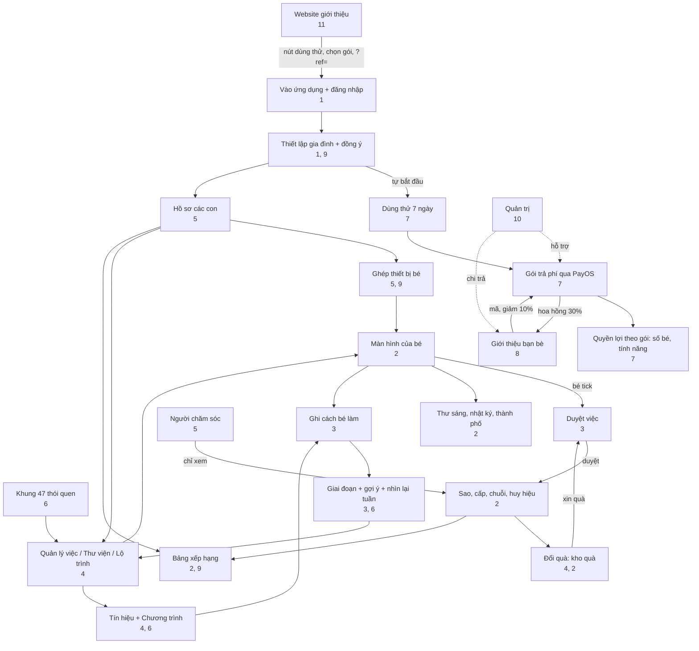

# 12. Bản đồ liên kết và tình huống

[← 11. Website và trang công khai](11-website-va-trang-cong-khai.md) · [Mục lục](README.md) · [Tiếp: 13. Thuật ngữ →](13-thuat-ngu.md)

## Trong tài liệu này

[Bản đồ liên kết](#ban-do) · [Ma trận phụ thuộc](#phu-thuoc) · [Hành trình xuyên suốt](#hanh-trinh) · [Một ngày điển hình](#mot-ngay) · [Xử lý sự cố](#su-co) · [Liên quan](#lien-quan)

Tài liệu này cho thấy các tính năng **nối với nhau thế nào**: tính năng nào cần tính năng nào, dữ liệu chảy ra sao, và một người dùng đi qua những tính năng nào trong một tình huống thật.

## Bản đồ liên kết

Ý nghĩa chính của sơ đồ:

- **Hai vòng lặp chạy hằng ngày**: *việc → bé tick → ba mẹ duyệt → sao → quà → xin quà → duyệt*, và *tick → ghi cách bé làm → giai đoạn và gợi ý → chỉnh việc*.
- **Gói là cổng** vào hầu hết khu phụ huynh: dùng thử và gói quyết định số bé và có quản lý được hay không.
- **Giới thiệu bạn bè** đi vòng qua thanh toán: mã trước khi mua cho giảm giá, thanh toán thành công sinh hoa hồng.
<!--op-->- **Quản trị** không nằm trong luồng của gia đình, chỉ hỗ trợ thanh toán, hoàn tiền, chi trả.<!--/op-->

## Ma trận phụ thuộc

Đọc theo hàng: tính năng ở cột trái **cần hoặc dùng** những gì ở cột giữa, và **sinh ra** gì ở cột phải.

| Tính năng | Cần / dùng | Sinh ra / ảnh hưởng | Xem |
|---|---|---|---|
| Hồ sơ bé | Có gói còn hiệu lực; xác nhận đồng ý | Giai đoạn tuổi, giao diện theo tuổi, mã ghép, gói việc theo tuổi | [5](05-gia-dinh-va-cai-dat.md#ho-so) |
| Ghép thiết bị | Hồ sơ bé; (PIN nếu có) | Màn hình bé không cần tài khoản; thiết bị thu hồi được | [5](05-gia-dinh-va-cai-dat.md#ghep-thiet-bi) |
| Việc (hoạt động) | Hồ sơ bé hoặc "cả nhà"; có thể từ khung, lộ trình, thư viện | Danh sách của bé; điểm; có thể cần duyệt | [4](04-thiet-ke-thoi-quen.md) |
| Bé tick | Việc; máy chủ chấp nhận ngày (hôm kia đến ngày mai) | Sao (hoặc chờ duyệt), chuỗi, huy hiệu, nhật ký hoạt động | [2](02-man-hinh-be.md#hoan-thanh) |
| Duyệt việc / quà | PIN nếu đặt | Cộng sao hoặc không; quà: duyệt → trao hoặc hoàn sao | [3](03-hom-nay-va-duyet-viec.md#duyet) |
| Sao | Việc đã xác nhận | Đổi quà, xây thành phố; không giảm tổng đã kiếm | [2](02-man-hinh-be.md#sao-cap-chuoi) |
| Huy hiệu 16 chân dung | Việc từ khung (mã khung) | Huy hiệu; chân dung 16 cần các chân dung còn lại | [2](02-man-hinh-be.md#huy-hieu), [6](06-khoa-hoc-thoi-quen.md#chan-dung) |
| Tín hiệu / chương trình | Việc đang dùng | Giai đoạn thói quen; gợi ý | [4](04-thiet-ke-thoi-quen.md#chuong-trinh) |
| Ghi cách bé làm | Việc đã hoàn thành | Làm gợi ý chính xác hơn; không dùng xếp hạng | [3](03-hom-nay-va-duyet-viec.md#muc-ho-tro) |
| Chuỗi ngày | Việc đã xác nhận; ngày tạm nghỉ | Ngọn lửa; hạng giải đấu | [2](02-man-hinh-be.md#sao-cap-chuoi) |
| Tạm nghỉ | Phụ huynh bấm | Ẩn nhắc tiến độ, chuỗi, BXH; tạm dừng nhắc việc; không phá chuỗi | [5](05-gia-dinh-va-cai-dat.md#tam-nghi) |
| Bảng xếp hạng công khai | Chia sẻ bật + bé được chọn | Biệt danh, điểm kỳ, hạng | [9](09-bao-mat-va-rieng-tu.md#bxh-cong-khai) |
| Nhắc việc | Phụ huynh đồng ý; có mục chờ duyệt; không tạm nghỉ | Biểu ngữ, thông báo trình duyệt | [3](03-hom-nay-va-duyet-viec.md#nhac-viec-ngan) |
| Thanh toán | Phụ huynh, đăng nhập, PIN nếu đặt | Gói + thời hạn; email biên nhận; hoa hồng | [7](07-goi-va-thanh-toan.md#thanh-toan) |
| Coupon | Gia đình có tài khoản | Cộng ngày dùng | [7](07-goi-va-thanh-toan.md#coupon) |
| Mã giới thiệu | Gia đình mới, chưa trả | Giảm 10% Gói Năm lần đầu; hoa hồng cho người giới thiệu | [8](08-gioi-thieu-ban-be.md) |
| Rút hoa hồng | Tham gia chương trình; PIN; đủ 200.000đ; qua hạn giữ | Yêu cầu chi trả → quản trị chuyển khoản | [8](08-gioi-thieu-ban-be.md#rut-tien) |
| Hoàn tiền | Ca hỗ trợ do khách yêu cầu | Thu hồi hoa hồng đơn đó; email trạng thái | [7](07-goi-va-thanh-toan.md#hoan-tien) |
| Người chăm sóc | Lời mời do phụ huynh; đăng nhập Google | Xem tiến độ chỉ đọc | [5](05-gia-dinh-va-cai-dat.md#nguoi-cham-soc) |
| Xóa dữ liệu | Chủ gia đình; PIN; gõ `DELETE FAMILY` | Xóa bé, việc, tiến độ, quà, thiết bị; không hoàn tác | [9](09-bao-mat-va-rieng-tu.md#xoa-du-lieu) |

## Hành trình xuyên suốt

### A. Gia đình mới, từ tìm hiểu tới thói quen đều

1. Đọc [blog](11-website-va-trang-cong-khai.md#blog), [khung](11-website-va-trang-cong-khai.md#trang-khung) và [bảng giá](11-website-va-trang-cong-khai.md#trang-chinh) trên website. Thử [bản demo](01-bat-dau.md#demo) nếu muốn.
2. Bấm **Dùng thử 7 ngày** → đăng nhập Google → [thiết lập gia đình](01-bat-dau.md#thiet-lap) (dùng thử tự bắt đầu).
3. Tạo [hồ sơ bé](05-gia-dinh-va-cai-dat.md#ho-so), nạp sáu việc theo tuổi hoặc chọn từ [khung](04-thiet-ke-thoi-quen.md#khung-47). Tạo vài [quà](04-thiet-ke-thoi-quen.md#kho-qua).
4. [Ghép máy](05-gia-dinh-va-cai-dat.md#ghep-thiet-bi) cho bé; đặt [PIN](05-gia-dinh-va-cai-dat.md#pin).
5. Chọn một đến hai việc, [đặt tín hiệu](04-thiet-ke-thoi-quen.md#chuong-trinh). Mỗi ngày bé tick, ba mẹ [duyệt](03-hom-nay-va-duyet-viec.md#duyet) và khen cụ thể.
6. Mỗi tuần [nhìn lại 5 phút](03-hom-nay-va-duyet-viec.md#nhin-lai-tuan); theo gợi ý để thêm, giữ nhịp hoặc chỉnh việc.
7. Trước ngày thứ 7, chọn [gói](07-goi-va-thanh-toan.md#cac-goi) để tiếp tục (có thể nhập [mã giới thiệu](08-gioi-thieu-ban-be.md#giam-10) trước khi trả).

### B. Thêm bé thứ hai

[Hồ sơ các con](05-gia-dinh-va-cai-dat.md#ho-so) → Thêm. Cần gói gia đình hoặc đang dùng thử (Gói Một Bé tối đa 1 bé). Có mã riêng và thiết bị riêng; [thu hồi](05-gia-dinh-va-cai-dat.md#thiet-bi) từng máy được.

### C. Gia đình đi xa hoặc ốm

Bấm [Tạm nghỉ](05-gia-dinh-va-cai-dat.md#tam-nghi): chuỗi không bị phá, không bị tính bỏ lỡ, nhắc việc dừng. Bấm Tiếp tục khi về.

### D. Giới thiệu một người bạn

Tham gia [chương trình](08-gioi-thieu-ban-be.md#tham-gia) → gửi liên kết → bạn nhập mã, được [giảm 10%](07-goi-va-thanh-toan.md#giam-gia) khi mua Gói Năm → bạn trả → bạn có [hoa hồng giữ 35 ngày](08-gioi-thieu-ban-be.md#hoa-hong) → đặt PIN và lưu tài khoản → [rút tiền](08-gioi-thieu-ban-be.md#rut-tien) → quản trị [chuyển khoản](10-quan-tri-va-van-hanh.md#gioi-thieu-admin).

<!--op-->### E. Khách xin hoàn tiền

Khách gửi mã đơn trong 30 ngày → hỗ trợ [mở ca](10-quan-tri-va-van-hanh.md#phieu-ho-tro) → tài chính duyệt → hoàn thủ công → xác nhận hoàn tất → [hoa hồng](08-gioi-thieu-ban-be.md#hoan-tien-hoa-hong) của đơn bị thu hồi → khách nhận [email](07-goi-va-thanh-toan.md#email).<!--/op-->

## Một ngày điển hình

| Giờ | Bé | Ba mẹ | Ghi chú |
|---|---|---|---|
| 07:00 trở đi | Đọc [thư của linh vật](02-man-hinh-be.md#thu-buoi-sang) | | Thư mới mỗi ngày |
| Buổi sáng | Làm các việc buổi sáng, [đếm giờ](02-man-hinh-be.md#dem-gio) đánh răng, tick | Nhận [nhắc](03-hom-nay-va-duyet-viec.md#nhac-viec-ngan) nếu có việc cần duyệt | Việc cần duyệt chờ ba mẹ |
| Buổi tối | Làm nốt việc, ghi [nhật ký một câu](02-man-hinh-be.md#nhat-ky), xem [huy hiệu](02-man-hinh-be.md#huy-hieu) | [Duyệt](03-hom-nay-va-duyet-viec.md#duyet), [ghi cách bé làm](03-hom-nay-va-duyet-viec.md#muc-ho-tro), khen cụ thể | Sao cộng khi duyệt |
| Cuối tuần | Có thể xin [quà](02-man-hinh-be.md#qua) | [Nhìn lại tuần](03-hom-nay-va-duyet-viec.md#nhin-lai-tuan), [in tuần](03-hom-nay-va-duyet-viec.md#thong-ke), trao quà | Gợi ý chỉnh việc |

## Xử lý sự cố

| Hiện tượng | Nguyên nhân thường gặp | Cách xử lý |
|---|---|---|
| Bé tick báo **"Chưa lưu được. Con thử lại nhé."** kèm mã trong ngoặc | Xem mã bên dưới | Thẻ tự trở về trạng thái cũ; thử lại |
| Mã `no-child` | Chưa chọn được hồ sơ bé trên máy này (đã sửa khi mở khu bé từ tài khoản phụ huynh) | Tải lại trang; nếu còn thì báo hỗ trợ kèm mã |
| Mã `no-session` | Thiết bị chưa đăng nhập hoặc chưa ghép | Đăng nhập lại (phụ huynh) hoặc ghép lại bằng [mã](05-gia-dinh-va-cai-dat.md#ghep-thiet-bi) (bé) |
| Mã `no-activity` | Việc vừa bị xóa hoặc chưa tải | Tải lại trang |
| Mã `request-401` | Phiên đã hết hạn | Đăng nhập lại |
| Mã `request-403` | Không đủ quyền hoặc cần mở khóa PIN | Nhập [PIN](05-gia-dinh-va-cai-dat.md#pin) hoặc dùng đúng tài khoản |
| Mã `request-409` | Máy chủ từ chối thay đổi (ví dụ ngày ngoài phạm vi cho phép, hồ sơ hoặc việc không còn khớp) | Tải lại; chọn ngày gần hôm nay |
| Mã `points-spent` | Sao của việc này đã dùng đổi quà nên không hoàn tác được | Giữ nguyên, hoặc ba mẹ [chỉnh sao](03-hom-nay-va-duyet-viec.md#chinh-sao) |
| Mã `error-…` | Lỗi mạng hoặc lỗi khác | Kiểm tra mạng rồi thử lại |
| Tick xong **chưa thấy sao** | Việc đang cần ba mẹ duyệt | [Duyệt](03-hom-nay-va-duyet-viec.md#duyet) |
| Không quét được QR | Chưa cấp quyền camera, không dùng https | Cấp quyền hoặc nhập mã tay |
| Mã ghép bị từ chối | Mã đã làm mới, nhập sai nhiều lần | Lấy mã mới ở [Hồ sơ các con](05-gia-dinh-va-cai-dat.md#ghep-thiet-bi), chờ vài phút nếu bị giới hạn |
| Chuyển khoản rồi chưa thấy gói | Đang chờ xác nhận từ PayOS | Chờ vài phút, mở lại `/checkout`; đừng trả lại; liên hệ hỗ trợ kèm mã đơn ([kích hoạt](07-goi-va-thanh-toan.md#kich-hoat)) |
| Không thêm được hồ sơ bé | Hết hạn, hoặc Gói Một Bé đã có 1 bé | Mua gói hoặc [nâng cấp](07-goi-va-thanh-toan.md#cac-goi) |
| Không thấy ô nhập mã giới thiệu | Gia đình đã trả tiền, quá hạn ghi nhận, hoặc đã có mã | Không thể ghi nhận thêm ([8](08-gioi-thieu-ban-be.md#giam-10)) |
| Không rút được hoa hồng | Chưa đặt PIN, chưa đủ 200.000đ, khoản còn trong thời gian giữ, vừa đổi thông tin nhận tiền (chờ 24 giờ) | Xem [rút tiền](08-gioi-thieu-ban-be.md#rut-tien) |
| Bé không thấy bảng xếp hạng công khai | Chia sẻ chưa bật, hoặc bé chưa được chọn, hoặc gia đình đang tạm nghỉ | [Bật chia sẻ](05-gia-dinh-va-cai-dat.md#rieng-tu) và chọn bé |
| Mất chuỗi ngày | Quá một ngày không có việc được xác nhận | Đếm lại; [tạm nghỉ](05-gia-dinh-va-cai-dat.md#tam-nghi) giúp lần sau |
| Không nhận email đăng nhập hoặc vòng đời | Vào thư rác; địa chỉ từng bị trả thư; đăng nhập bằng mã email đang tắt | Kiểm tra thư rác; dùng Google |
| Mất máy của bé | Cần chặn truy cập | [Thu hồi thiết bị](05-gia-dinh-va-cai-dat.md#thiet-bi), làm mới mã |

Khi liên hệ hỗ trợ ([Liên hệ](11-website-va-trang-cong-khai.md#trang-chinh)): gửi mã hỗ trợ, thời điểm và thao tác vừa làm. **Đừng gửi** mật khẩu, mã PIN hay mã ghép còn hiệu lực.

## Liên quan

[Mục lục](README.md) · [Thuật ngữ](13-thuat-ngu.md) · [Bảo mật và riêng tư](09-bao-mat-va-rieng-tu.md)<!--op--> · [Quản trị và vận hành](10-quan-tri-va-van-hanh.md)<!--/op-->
