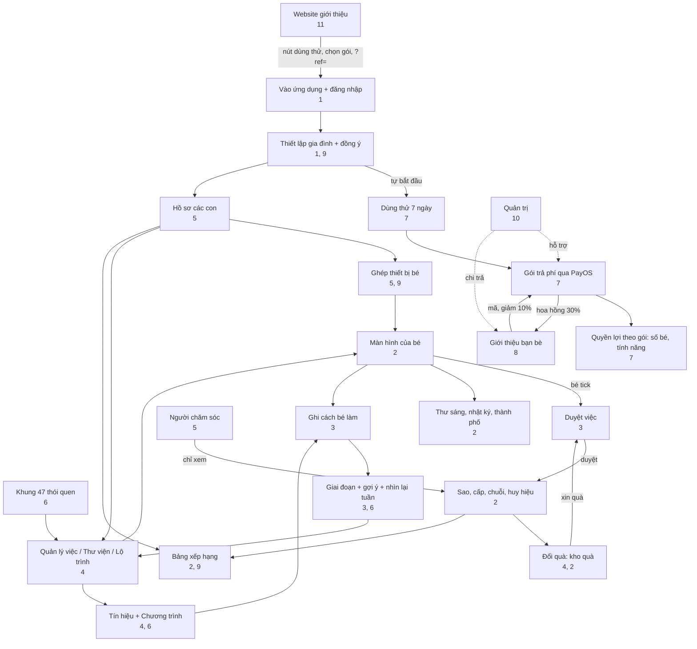

# 12. Link Map and Scenarios

[← 11. Website and public pages](11-website-va-trang-cong-khai.md) · [Table of contents](README.md) · [Next: 13. Glossary →](13-thuat-ngu.md)

<!--op-->## In this document

[Link map](#ban-do) · [Dependency matrix](#phu-thuoc) · [End-to-end journeys](#hanh-trinh) · [A typical day](#mot-ngay) · [Troubleshooting](#su-co) · [Related](#lien-quan)<!--/op-->

This document shows **how the features connect**: which features depend on which others, how data flows, and which features a user moves through in a real-life scenario.

## Link map

Key points from the diagram:

- **Two daily loops**: *task → child marks it done → parent approves → stars → reward → reward request → approval*, and *mark done → record how the child did it → stage and suggestions → adjust the task*.
- **The plan is the gateway** to most parent areas: the trial and plan determine the number of children and whether management features are available.
- **Referrals** go through payment: the code gives a discount before purchase, and a successful payment generates a commission.
<!--op-->- **Admin** is outside the family flow and only supports payments, refunds, and payouts.<!--/op-->

## Dependency matrix

Read each row from left to right: the feature in the first column **needs or uses** the items in the middle column and **produces or affects** the items in the last column.

| Feature | Needs / uses | Produces / affects | See |
|---|---|---|---|
| Child profile | An active plan; consent confirmation | Age stage, age-based interface, pairing code, age-based task plan | [5](05-gia-dinh-va-cai-dat.md#ho-so) |
| Device pairing | Child profile; (PIN if set) | Child screen without an account; device access can be revoked | [5](05-gia-dinh-va-cai-dat.md#ghep-thiet-bi) |
| Task (activity) | Child profile or "Family"; may come from a framework, roadmap, or library | Child's task list; points; may require approval | [4](04-thiet-ke-thoi-quen.md) |
| Child marks a task done | Task; server accepts dates from two days ago through tomorrow | Stars (or pending approval), streak, badges, activity journal | [2](02-man-hinh-be.md#hoan-thanh) |
| Approve task / reward | PIN if set | Stars added or not; reward: approve → deliver or return stars | [3](03-hom-nay-va-duyet-viec.md#duyet) |
| Stars | Confirmed tasks | Redeem rewards, build the city; total earned never decreases | [2](02-man-hinh-be.md#sao-cap-chuoi) |
| 16-portrait badge | Tasks from the framework (framework code) | Badge; portrait 16 requires the other portraits | [2](02-man-hinh-be.md#huy-hieu), [6](06-khoa-hoc-thoi-quen.md#chan-dung) |
| Cues / programmes | Tasks currently in use | Habit stage; suggestions | [4](04-thiet-ke-thoi-quen.md#chuong-trinh) |
| Record how the child did it | Completed task | More accurate suggestions; not used for rankings | [3](03-hom-nay-va-duyet-viec.md#muc-ho-tro) |
| Day streak | Confirmed tasks; family break days | Flame; league rank | [2](02-man-hinh-be.md#sao-cap-chuoi) |
| Family break | Parent action | Hides progress prompts, streaks, and rankings; pauses task reminders; does not break the streak | [5](05-gia-dinh-va-cai-dat.md#tam-nghi) |
| Public leaderboard | Sharing enabled + selected child | Nickname, period score, rank | [9](09-bao-mat-va-rieng-tu.md#bxh-cong-khai) |
| Task reminder | Parent consent; an item awaiting approval; family not paused | Banner, browser notification | [3](03-hom-nay-va-duyet-viec.md#nhac-viec-ngan) |
| Payment | Parent, signed-in account, PIN if set | Plan + term; receipt email; commission | [7](07-goi-va-thanh-toan.md#thanh-toan) |
| Coupon | Family account | Extra days | [7](07-goi-va-thanh-toan.md#coupon) |
| Referral code | New family that has not paid | 10% off the first order of either yearly plan; commission for the referrer | [8](08-gioi-thieu-ban-be.md) |
| Withdraw commission | Programme membership; PIN; at least 200,000 VND; hold period over | Payout request → admin bank transfer | [8](08-gioi-thieu-ban-be.md#rut-tien) |
| Refund | Support case requested by the customer | Commission for that order reclaimed; status email | [7](07-goi-va-thanh-toan.md#hoan-tien) |
| Caregiver | Parent invitation; Google sign-in | Read-only progress view | [5](05-gia-dinh-va-cai-dat.md#nguoi-cham-soc) |
| Delete data | Family owner; PIN; type `DELETE FAMILY` | Deletes children, tasks, progress, rewards, and devices; cannot be undone | [9](09-bao-mat-va-rieng-tu.md#xoa-du-lieu) |

## End-to-end journeys

### A. A new family, from learning about the app to a steady routine

1. Read the [blog](11-website-va-trang-cong-khai.md#blog), [framework](11-website-va-trang-cong-khai.md#trang-khung), and [pricing page](11-website-va-trang-cong-khai.md#trang-chinh) on the website. Try the [demo](01-bat-dau.md#demo) if you like.
2. Click **7-Day Free Trial** → sign in with Google → [set up your family](01-bat-dau.md#thiet-lap) (the trial starts automatically).
3. Create a [child profile](05-gia-dinh-va-cai-dat.md#ho-so), load six age-based tasks, or choose from the [framework](04-thiet-ke-thoi-quen.md#khung-47). Create a few [rewards](04-thiet-ke-thoi-quen.md#kho-qua).
4. [Pair a device](05-gia-dinh-va-cai-dat.md#ghep-thiet-bi) for your child; set a [PIN](05-gia-dinh-va-cai-dat.md#pin).
5. Choose one or two tasks and [set a cue](04-thiet-ke-thoi-quen.md#chuong-trinh). Each day, your child marks tasks done, you [approve them](03-hom-nay-va-duyet-viec.md#duyet), and give specific praise.
6. Each week, [look back for 5 minutes](03-hom-nay-va-duyet-viec.md#nhin-lai-tuan); use the suggestions to add a task, keep the rhythm, or adjust a task.
7. Before day 7, choose a [plan](07-goi-va-thanh-toan.md#cac-goi) to continue (you can enter a [referral code](08-gioi-thieu-ban-be.md#giam-10) before paying).

### B. Add a second child

[Children](05-gia-dinh-va-cai-dat.md#ho-so) → Add. You need an active plan or trial (the Basic plan allows up to 1 child; the Pro plan and the trial allow up to 5). Each child has a separate code and device; each device can be [revoked](05-gia-dinh-va-cai-dat.md#thiet-bi) separately.

### C. Your family is away or someone is ill

Choose [Take a break](05-gia-dinh-va-cai-dat.md#tam-nghi): the streak is preserved, missed days are not counted, and task reminders stop. Choose Resume when you return.

### D. Refer a friend

Join the [programme](08-gioi-thieu-ban-be.md#tham-gia) → send the link → your friend enters the code and gets [10% off](07-goi-va-thanh-toan.md#giam-gia) when buying a yearly plan → your friend pays → you have a [commission held for 40 days](08-gioi-thieu-ban-be.md#hoa-hong) (still frozen while the order has an open refund or billing case) → set a PIN and save your payout details → [request a withdrawal](08-gioi-thieu-ban-be.md#rut-tien) → admin [transfers the money](10-quan-tri-va-van-hanh.md#gioi-thieu-admin).

<!--op-->### E. A customer requests a refund

The customer sends the order code within 30 days → support [opens a case](10-quan-tri-va-van-hanh.md#phieu-ho-tro) → finance approves → the refund is processed manually → completion is confirmed → the order's [commission](08-gioi-thieu-ban-be.md#hoan-tien-hoa-hong) is reclaimed → the customer receives an [email](07-goi-va-thanh-toan.md#email).<!--/op-->

## A typical day

| Time | Child | Parents | Notes |
|---|---|---|---|
| From 07:00 | Read the [mascot's letter](02-man-hinh-be.md#thu-buoi-sang) | | A new letter each day |
| Morning | Do the morning tasks, [time](02-man-hinh-be.md#dem-gio) toothbrushing, and mark tasks done | Receive a [reminder](03-hom-nay-va-duyet-viec.md#nhac-viec-ngan) if a task needs approval | Tasks needing approval wait for parents |
| Evening | Finish the remaining tasks, write a [one-sentence journal entry](02-man-hinh-be.md#nhat-ky), and view [badges](02-man-hinh-be.md#huy-hieu) | [Approve](03-hom-nay-va-duyet-viec.md#duyet), [record how the child did it](03-hom-nay-va-duyet-viec.md#muc-ho-tro), and give specific praise | Stars are added when approved |
| Weekend | May request a [reward](02-man-hinh-be.md#qua) | [Look back at the week](03-hom-nay-va-duyet-viec.md#nhin-lai-tuan), [print the week](03-hom-nay-va-duyet-viec.md#thong-ke), and give the reward | Suggestions for adjusting tasks |

## Troubleshooting

| Symptom | Common cause | What to do |
|---|---|---|
| Child marks a task done and sees **"Could not save. Please try again."** with a code in parentheses | Check the code below | The card returns to its previous state; try again |
| Code `no-child` | A child profile could not be selected on this device (fixed when opening Kid Mode from the parent's account) | Reload the page; if it remains, contact support with the code |
| Code `no-session` | The device is not signed in or has not been paired | Sign in again as a parent, or pair again with the [code](05-gia-dinh-va-cai-dat.md#ghep-thiet-bi) on the child device |
| Code `no-activity` | The task was just deleted or has not loaded | Reload the page |
| Code `request-401` | The session has expired | Sign in again |
| Code `request-403` | You do not have permission or the PIN must be unlocked | Enter the [PIN](05-gia-dinh-va-cai-dat.md#pin) or use the correct account |
| Code `request-409` | The server rejected the change (for example, a date outside the allowed range, or a profile or task no longer matches) | Reload and choose a date close to today |
| Code `points-spent` | Stars from this task have already been spent on a reward, so the change cannot be undone | Keep it as is, or have a parent [adjust the stars](03-hom-nay-va-duyet-viec.md#chinh-sao) |
| Code `error-…` | Network or other error | Check your connection and try again |
| After marking a task done, **no stars appear** | The task needs parent approval | [Approve it](03-hom-nay-va-duyet-viec.md#duyet) |
| QR code cannot be scanned | Camera permission has not been granted, or the connection is not using https | Grant permission or enter the code manually |
| Pairing code rejected | The code was refreshed, or too many incorrect attempts were made | Get a new code from [Children](05-gia-dinh-va-cai-dat.md#ghep-thiet-bi); wait a few minutes if you are rate-limited |
| Payment transferred but plan has not appeared | Waiting for PayOS confirmation | Wait a few minutes and reopen `/checkout`; do not pay again; contact support with the order code ([activation](07-goi-va-thanh-toan.md#kich-hoat)) |
| Cannot add a child profile | The plan has expired, the Basic plan already has 1 child, or the Pro plan already has 5 | Buy a plan or [upgrade](07-goi-va-thanh-toan.md#cac-goi) |
| Referral code field is missing | The family has already paid, the recording window has expired, or a code already exists | No additional code can be recorded ([8](08-gioi-thieu-ban-be.md#giam-10)) |
| Cannot withdraw commission | No PIN set, less than 200,000 VND, the amount is still within the hold period, or payout details were just changed (24-hour wait) | See [request a withdrawal](08-gioi-thieu-ban-be.md#rut-tien) |
| Child cannot see the public leaderboard | Sharing is off, the child has not been selected, or the family is paused | [Enable sharing](05-gia-dinh-va-cai-dat.md#rieng-tu) and select the child |
| Day streak is lost | More than one day passed without a confirmed task | Check the count again; [Take a break](05-gia-dinh-va-cai-dat.md#tam-nghi) helps next time |
| Login or lifecycle email does not arrive | It went to spam; the address previously bounced; email-code sign-in is disabled | Check spam; use Google |
| Child's device is lost | Access needs to be blocked | [Revoke the device](05-gia-dinh-va-cai-dat.md#thiet-bi) and refresh the code |

When contacting support ([Contact](11-website-va-trang-cong-khai.md#trang-chinh)): send the support code, time, and the action you just took. **Do not send** passwords, PINs, or unexpired pairing codes.

## Related

[Table of contents](README.md) · [Glossary](13-thuat-ngu.md) · [Privacy and security](09-bao-mat-va-rieng-tu.md)<!--op--> · [Admin and operations](10-quan-tri-va-van-hanh.md)<!--/op-->
