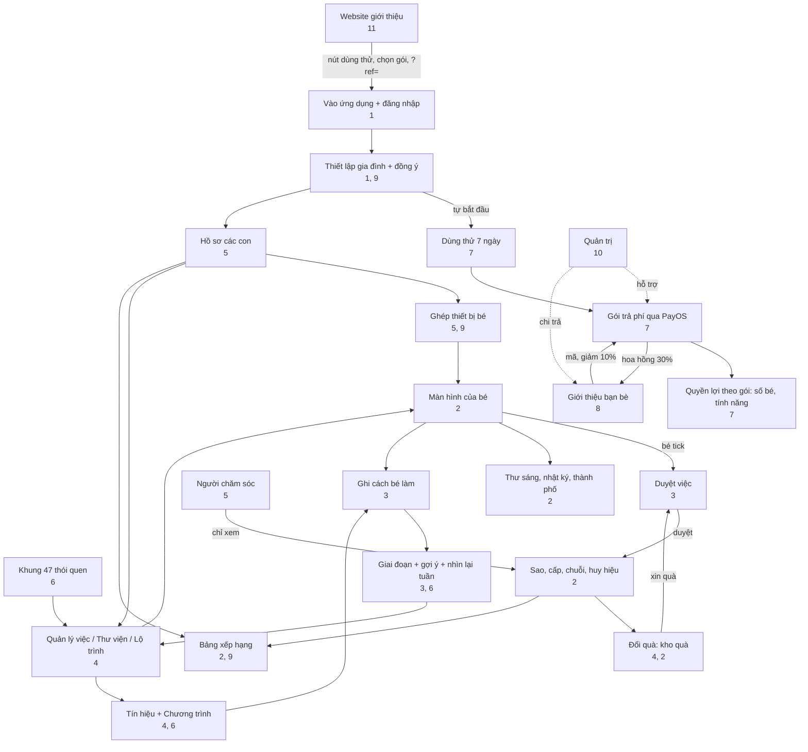

# 12. Verbindungen und Abläufe

[← 11. Website und öffentliche Seiten](11-website-va-trang-cong-khai.md) · [Inhaltsverzeichnis](README.md) · [Weiter: 13. Glossar →](13-thuat-ngu.md)

<!--op-->## In diesem Dokument

[Verbindungsübersicht](#ban-do) · [Abhängigkeitsmatrix](#phu-thuoc) · [Durchgängige Abläufe](#hanh-trinh) · [Ein typischer Tag](#mot-ngay) · [Fehlerbehebung](#su-co) · [Weiterführendes](#lien-quan)<!--/op-->

Dieses Dokument zeigt, **wie die Funktionen miteinander verbunden sind**: welche Funktionen von anderen abhängen, wie Daten fließen und welche Funktionen Nutzerinnen und Nutzer in einem Alltagsszenario durchlaufen.

## Verbindungsübersicht

Wichtige Punkte des Diagramms:

- **Zwei tägliche Abläufe**: *Aufgabe → Kind markiert sie als erledigt → Elternteil bestätigt → Sterne → Belohnung → Belohnungsanfrage → Bestätigung* sowie *als erledigt markieren → erfassen, wie das Kind es geschafft hat → Phase und Vorschläge → Aufgabe anpassen*.
- **Der Tarif ist der Zugang** zu den meisten Elternbereichen: Testphase und Tarif bestimmen die Kinderanzahl und ob Verwaltungsfunktionen verfügbar sind.
- **Empfehlungen** laufen über die Zahlung: Der Code gewährt vor dem Kauf einen Rabatt, und eine erfolgreiche Zahlung löst eine Provision aus.
<!--op-->- **Administration** liegt außerhalb des Familienablaufs und unterstützt nur Zahlungen, Rückerstattungen und Auszahlungen.<!--/op-->

## Abhängigkeitsmatrix

Lesen Sie jede Zeile von links nach rechts: Die Funktion in der ersten Spalte **benötigt oder verwendet** die Elemente in der mittleren Spalte und **erzeugt oder beeinflusst** die Elemente in der letzten Spalte.

| Funktion | Benötigt / verwendet | Erzeugt / beeinflusst | Siehe |
|---|---|---|---|
| Kinderprofil | Aktiver Tarif; Einwilligungsbestätigung | Altersstufe, altersgerechte Oberfläche, Kopplungscode, altersgerechter Aufgabenplan | [5](05-gia-dinh-va-cai-dat.md#ho-so) |
| Gerätekopplung | Kinderprofil; (PIN, falls eingerichtet) | Kinderansicht ohne Konto; Gerätezugriff kann widerrufen werden | [5](05-gia-dinh-va-cai-dat.md#ghep-thiet-bi) |
| Aufgabe (Aktivität) | Kinderprofil oder „Familie“; kann aus Rahmenwerk, Entwicklungsplan oder Bibliothek stammen | Aufgabenliste des Kindes; Punkte; eventuell Bestätigung erforderlich | [4](04-thiet-ke-thoi-quen.md) |
| Kind markiert Aufgabe als erledigt | Aufgabe; Server akzeptiert Daten von vorgestern bis morgen | Sterne (oder ausstehende Bestätigung), Serie, Abzeichen, Aktivitätsverlauf | [2](02-man-hinh-be.md#hoan-thanh) |
| Aufgabe / Belohnung bestätigen | PIN, falls eingerichtet | Sterne werden gutgeschrieben oder nicht; Belohnung: bestätigen → übergeben oder Sterne zurückgeben | [3](03-hom-nay-va-duyet-viec.md#duyet) |
| Sterne | Bestätigte Aufgaben | Belohnungen einlösen, Stadt bauen; insgesamt verdiente Sterne nehmen nie ab | [2](02-man-hinh-be.md#sao-cap-chuoi) |
| Abzeichen für die 16 Profile | Aufgaben aus dem Rahmenwerk (Rahmenwerk-Code) | Abzeichen; Profil 16 setzt die anderen Profile voraus | [2](02-man-hinh-be.md#huy-hieu), [6](06-khoa-hoc-thoi-quen.md#chan-dung) |
| Auslöser / Programme | Gewohnheiten in Verwendung | Gewohnheitsphase; Vorschläge | [4](04-thiet-ke-thoi-quen.md#chuong-trinh) |
| Erfassen, wie das Kind es geschafft hat | Erledigte Aufgabe | Genauere Vorschläge; wird nicht für Ranglisten verwendet | [3](03-hom-nay-va-duyet-viec.md#muc-ho-tro) |
| Tages-Serie | Bestätigte Aufgaben; Pausentage der Familie | Flamme; Ligaplatz | [2](02-man-hinh-be.md#sao-cap-chuoi) |
| Familienpause | Aktion der Eltern | Blendet Fortschrittshinweise, Serien und Ranglisten aus; pausiert Aufgabenerinnerungen; unterbricht die Serie nicht | [5](05-gia-dinh-va-cai-dat.md#tam-nghi) |
| Öffentliche Rangliste | Freigabe aktiviert + Kind ausgewählt | Spitzname, Punktzahl des Zeitraums, Rang | [9](09-bao-mat-va-rieng-tu.md#bxh-cong-khai) |
| Aufgabenerinnerung | Einwilligung der Eltern; Element wartet auf Bestätigung; Familie macht keine Pause | Banner, Browserbenachrichtigung | [3](03-hom-nay-va-duyet-viec.md#nhac-viec-ngan) |
| Zahlung | Elternteil, angemeldetes Konto, PIN falls eingerichtet | Tarif + Laufzeit; Zahlungsbeleg per E-Mail; Provision | [7](07-goi-va-thanh-toan.md#thanh-toan) |
| Gutschein | Familienkonto | Zusätzliche Tage | [7](07-goi-va-thanh-toan.md#coupon) |
| Empfehlungscode | Neue Familie, die noch nicht bezahlt hat | 10 % Rabatt auf den ersten Jahrestarif; Provision für die werbende Person | [8](08-gioi-thieu-ban-be.md) |
| Provision auszahlen | Programmteilnahme; PIN; mindestens 200,000 VND; Zurückhaltefrist abgelaufen | Auszahlungsanfrage → Banküberweisung durch Admin | [8](08-gioi-thieu-ban-be.md#rut-tien) |
| Rückerstattung | Von der Kundschaft angefragter Supportfall | Provision für die Bestellung wird zurückgefordert; Status-E-Mail | [7](07-goi-va-thanh-toan.md#hoan-tien) |
| Betreuungsperson | Einladung eines Elternteils; Google-Anmeldung | Fortschrittsansicht im Nur-Lese-Modus | [5](05-gia-dinh-va-cai-dat.md#nguoi-cham-soc) |
| Daten löschen | Familieninhaber; PIN; `DELETE FAMILY` eingeben | Löscht Kinder, Aufgaben, Fortschritt, Belohnungen und Geräte; kann nicht rückgängig gemacht werden | [9](09-bao-mat-va-rieng-tu.md#xoa-du-lieu) |

## Durchgängige Abläufe

### A. Eine neue Familie: von der ersten Information bis zu einer gefestigten Routine

1. Lesen Sie auf der Website den [Blog](11-website-va-trang-cong-khai.md#blog), das [Rahmenwerk](11-website-va-trang-cong-khai.md#trang-khung) und die [Preisseite](11-website-va-trang-cong-khai.md#trang-chinh). Wenn Sie möchten, probieren Sie die [Demo](01-bat-dau.md#demo) aus.
2. Klicken Sie auf **7-tägige kostenlose Testphase** → melden Sie sich mit Google an → [richten Sie Ihre Familie ein](01-bat-dau.md#thiet-lap) (die Testphase beginnt automatisch).
3. Erstellen Sie ein [Kinderprofil](05-gia-dinh-va-cai-dat.md#ho-so), laden Sie sechs altersgerechte Aufgaben oder wählen Sie Aufgaben aus dem [Rahmenwerk](04-thiet-ke-thoi-quen.md#khung-47). Erstellen Sie einige [Belohnungen](04-thiet-ke-thoi-quen.md#kho-qua).
4. [Koppeln Sie ein Gerät](05-gia-dinh-va-cai-dat.md#ghep-thiet-bi) für Ihr Kind und legen Sie eine [PIN](05-gia-dinh-va-cai-dat.md#pin) fest.
5. Wählen Sie eine oder zwei Aufgaben aus und [legen Sie einen Auslöser fest](04-thiet-ke-thoi-quen.md#chuong-trinh). Täglich markiert Ihr Kind Aufgaben als erledigt, Sie [bestätigen sie](03-hom-nay-va-duyet-viec.md#duyet) und sprechen konkretes Lob aus.
6. Betrachten Sie jede Woche [fünf Minuten lang den Rückblick](03-hom-nay-va-duyet-viec.md#nhin-lai-tuan). Nutzen Sie die Vorschläge, um eine Aufgabe hinzuzufügen, den Rhythmus beizubehalten oder eine Aufgabe anzupassen.
7. Wählen Sie vor dem 7. Tag einen [Tarif](07-goi-va-thanh-toan.md#cac-goi), um fortzufahren (vor der Zahlung können Sie einen [Empfehlungscode](08-gioi-thieu-ban-be.md#giam-10) eingeben).

### B. Ein zweites Kind hinzufügen

[Kinder](05-gia-dinh-va-cai-dat.md#ho-so) → Hinzufügen. Sie benötigen einen Familientarif oder eine aktive Testphase (der Tarif für ein Kind erlaubt höchstens 1 Kind). Jedes Kind hat einen eigenen Code und ein eigenes Gerät; jedes Gerät kann einzeln [entkoppelt](05-gia-dinh-va-cai-dat.md#thiet-bi) werden.

### C. Ihre Familie verreist oder jemand ist krank

Wählen Sie [Pause machen](05-gia-dinh-va-cai-dat.md#tam-nghi): Die Serie bleibt erhalten, versäumte Tage werden nicht gezählt und Aufgabenerinnerungen werden unterbrochen. Wählen Sie bei Ihrer Rückkehr „Fortsetzen“.

### D. Eine Freundin oder einen Freund werben

Nehmen Sie am [Programm](08-gioi-thieu-ban-be.md#tham-gia) teil → senden Sie den Link → Ihre Freundin oder Ihr Freund gibt den Code ein und erhält beim Kauf des Jahrestarifs [10 % Rabatt](07-goi-va-thanh-toan.md#giam-gia) → die Person bezahlt → Ihre [Provision wird 35 Tage zurückgehalten](08-gioi-thieu-ban-be.md#hoa-hong) → legen Sie eine PIN fest und speichern Sie Ihre Auszahlungsdaten → [fordern Sie eine Auszahlung an](08-gioi-thieu-ban-be.md#rut-tien) → Admin [überweist das Geld](10-quan-tri-va-van-hanh.md#gioi-thieu-admin).

<!--op-->### E. Eine Kundin oder ein Kunde beantragt eine Rückerstattung

Die Kundin oder der Kunde sendet den Bestellcode innerhalb von 30 Tagen → der Support [legt einen Fall an](10-quan-tri-va-van-hanh.md#phieu-ho-tro) → die Finanzabteilung genehmigt → die Rückerstattung wird manuell bearbeitet → der Abschluss wird bestätigt → die [Provision](08-gioi-thieu-ban-be.md#hoan-tien-hoa-hong) für die Bestellung wird zurückgefordert → die Kundin oder der Kunde erhält eine [E-Mail](07-goi-va-thanh-toan.md#email).<!--/op-->

## Ein typischer Tag

| Tageszeit | Kind | Eltern | Hinweise |
|---|---|---|---|
| Ab 07:00 Uhr | [Brief des Maskottchens](02-man-hinh-be.md#thu-buoi-sang) lesen | | Jeden Tag ein neuer Brief |
| Morgen | Morgenaufgaben erledigen, Zähneputzen mit [Timer](02-man-hinh-be.md#dem-gio), Aufgaben als erledigt markieren | [Erinnerung](03-hom-nay-va-duyet-viec.md#nhac-viec-ngan) erhalten, wenn eine Aufgabe bestätigt werden muss | Bestätigungspflichtige Aufgaben warten auf die Eltern |
| Abend | Verbleibende Aufgaben erledigen, einen [Tagebucheintrag mit einem Satz](02-man-hinh-be.md#nhat-ky) schreiben und [Abzeichen](02-man-hinh-be.md#huy-hieu) ansehen | [Bestätigen](03-hom-nay-va-duyet-viec.md#duyet), [erfassen, wie das Kind es geschafft hat](03-hom-nay-va-duyet-viec.md#muc-ho-tro), konkret loben | Sterne werden nach der Bestätigung gutgeschrieben |
| Wochenende | Vielleicht eine [Belohnung](02-man-hinh-be.md#qua) anfragen | [Woche rückblickend betrachten](03-hom-nay-va-duyet-viec.md#nhin-lai-tuan), [Wochenübersicht drucken](03-hom-nay-va-duyet-viec.md#thong-ke) und Belohnung übergeben | Vorschläge zur Anpassung von Aufgaben |

## Fehlerbehebung

| Symptom | Häufige Ursache | Vorgehen |
|---|---|---|
| Kind markiert Aufgabe als erledigt und sieht **„Speichern nicht möglich. Bitte versuchen Sie es erneut.“** mit einem Code in Klammern | Prüfen Sie den Code unten | Die Karte kehrt zum vorherigen Status zurück; versuchen Sie es erneut |
| Code `no-child` | Auf diesem Gerät konnte kein Kinderprofil ausgewählt werden (wird behoben, wenn der Kindermodus über das Elternkonto geöffnet wird) | Seite neu laden; bleibt der Fehler bestehen, Support mit dem Code kontaktieren |
| Code `no-session` | Gerät ist nicht angemeldet oder wurde nicht gekoppelt | Erneut als Elternteil anmelden oder das Kindergerät erneut mit dem [Code](05-gia-dinh-va-cai-dat.md#ghep-thiet-bi) koppeln |
| Code `no-activity` | Aufgabe wurde gerade gelöscht oder noch nicht geladen | Seite neu laden |
| Code `request-401` | Sitzung ist abgelaufen | Erneut anmelden |
| Code `request-403` | Sie haben keine Berechtigung oder die PIN muss freigeschaltet werden | [PIN](05-gia-dinh-va-cai-dat.md#pin) eingeben oder das richtige Konto verwenden |
| Code `request-409` | Server hat die Änderung abgelehnt (zum Beispiel Datum außerhalb des zulässigen Bereichs oder Profil bzw. Aufgabe stimmt nicht mehr überein) | Seite neu laden und ein Datum in der Nähe des heutigen Tages auswählen |
| Code `points-spent` | Sterne dieser Aufgabe wurden bereits für eine Belohnung ausgegeben; die Änderung kann daher nicht rückgängig gemacht werden | So belassen oder von einem Elternteil die [Sterne anpassen](03-hom-nay-va-duyet-viec.md#chinh-sao) lassen |
| Code `error-…` | Netzwerk- oder sonstiger Fehler | Verbindung prüfen und erneut versuchen |
| Nach dem Erledigen erscheinen **keine Sterne** | Aufgabe erfordert eine Bestätigung durch Eltern | [Bestätigen](03-hom-nay-va-duyet-viec.md#duyet) |
| QR-Code kann nicht gescannt werden | Kameraberechtigung fehlt oder die Verbindung verwendet kein https | Berechtigung erteilen oder Code manuell eingeben |
| Kopplungscode wird abgelehnt | Code wurde erneuert oder es gab zu viele falsche Versuche | Unter [Kinder](05-gia-dinh-va-cai-dat.md#ghep-thiet-bi) einen neuen Code abrufen; bei Ratenbegrenzung einige Minuten warten |
| Zahlung überwiesen, Tarif wird aber nicht angezeigt | Bestätigung durch PayOS steht aus | Einige Minuten warten und `/checkout` erneut öffnen; nicht erneut zahlen; Support mit Bestellcode kontaktieren ([Aktivierung](07-goi-va-thanh-toan.md#kich-hoat)) |
| Kinderprofil kann nicht hinzugefügt werden | Tarif ist abgelaufen oder der Tarif für ein Kind hat bereits 1 Kind | Tarif kaufen oder [wechseln](07-goi-va-thanh-toan.md#cac-goi) |
| Feld für Empfehlungscode fehlt | Familie hat bereits bezahlt, Eingabezeitraum ist abgelaufen oder es gibt bereits einen Code | Es kann kein weiterer Code erfasst werden ([8](08-gioi-thieu-ban-be.md#giam-10)) |
| Provision kann nicht ausgezahlt werden | Keine PIN, weniger als 200,000 VND, Betrag noch im Zurückhaltezeitraum oder Auszahlungsdaten gerade geändert (24 Stunden Wartezeit) | Siehe [Auszahlung anfordern](08-gioi-thieu-ban-be.md#rut-tien) |
| Kind sieht die öffentliche Rangliste nicht | Freigabe ist ausgeschaltet, Kind wurde nicht ausgewählt oder Familie macht Pause | [Freigabe aktivieren](05-gia-dinh-va-cai-dat.md#rieng-tu) und Kind auswählen |
| Tages-Serie ist verloren | Mehr als ein Tag ohne bestätigte Aufgabe vergangen | Zählung prüfen; [Pause machen](05-gia-dinh-va-cai-dat.md#tam-nghi) hilft beim nächsten Mal |
| Anmelde- oder Lebenszyklus-E-Mail kommt nicht an | Im Spam gelandet; frühere Zustellung an die Adresse fehlgeschlagen; Anmeldung per E-Mail-Code deaktiviert | Spam prüfen; Google verwenden |
| Gerät des Kindes ist verloren gegangen | Zugriff muss gesperrt werden | [Gerät entkoppeln](05-gia-dinh-va-cai-dat.md#thiet-bi) und Code erneuern |

Wenn Sie den Support kontaktieren ([Kontakt](11-website-va-trang-cong-khai.md#trang-chinh)): Senden Sie Supportcode, Uhrzeit und die soeben ausgeführte Aktion. **Senden Sie keine** Passwörter, PINs oder noch gültigen Kopplungscodes.

## Weiterführendes

[Inhaltsverzeichnis](README.md) · [Glossar](13-thuat-ngu.md) · [Datenschutz und Sicherheit](09-bao-mat-va-rieng-tu.md)<!--op--> · [Verwaltung und Betrieb](10-quan-tri-va-van-hanh.md)<!--/op-->
