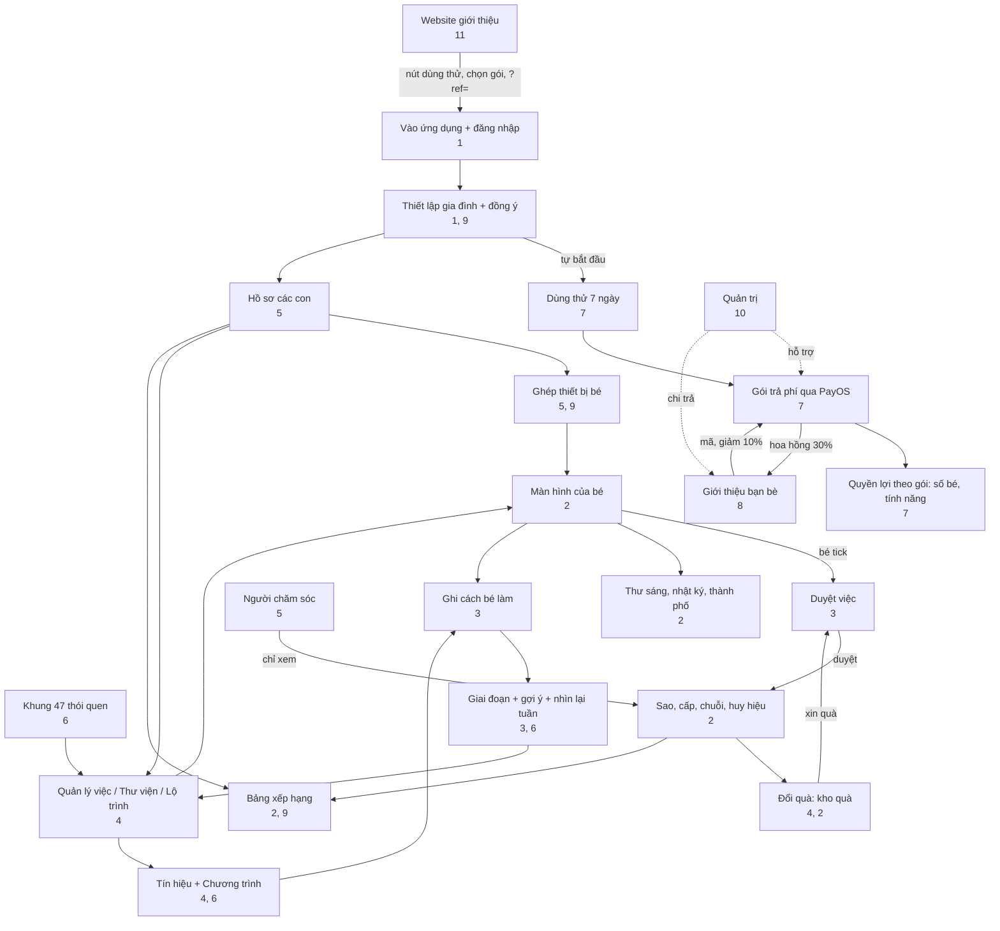

# 12. Mapa de conexiones y escenarios

[← 11. Sitio web y páginas públicas](11-website-va-trang-cong-khai.md) · [Índice](README.md) · [Siguiente: 13. Glosario →](13-thuat-ngu.md)

<!--op-->## En este documento

[Mapa de conexiones](#ban-do) · [Matriz de dependencias](#phu-thuoc) · [Recorridos de principio a fin](#hanh-trinh) · [Un día típico](#mot-ngay) · [Solución de problemas](#su-co) · [Relacionado](#lien-quan)<!--/op-->

Este documento muestra **cómo se conectan las funciones**: de cuáles dependen las demás, cómo fluyen los datos y qué funciones recorre una persona en una situación cotidiana.

## Mapa de conexiones

Puntos clave del diagrama:

- **Dos ciclos diarios**: *tarea → el niño la marca como completada → los padres la aprueban → estrellas → recompensa → solicitud de recompensa → aprobación* y *marcar como completada → registrar cómo lo hizo el niño → fases y sugerencias → ajustar la tarea*.
- **El plan es la puerta de acceso** a la mayoría de las áreas para padres: la prueba y el plan determinan la cantidad de niños y si están disponibles las funciones de gestión.
- Las **recomendaciones** pasan por el pago: el código da un descuento antes de la compra y un pago correcto genera una comisión.
<!--op-->- **Administración** está fuera del flujo familiar y solo presta apoyo para pagos, reembolsos y abonos.<!--/op-->

## Matriz de dependencias

Lea cada fila de izquierda a derecha: la función de la primera columna **necesita o usa** los elementos de la columna central y **genera o afecta** los de la última.

| Función | Necesita / usa | Genera / afecta | Consulte |
|---|---|---|---|
| Perfil del niño | Plan activo; confirmación del consentimiento | Etapa de edad, interfaz según la edad, código de vinculación, plan de tareas por edad | [5](05-gia-dinh-va-cai-dat.md#ho-so) |
| Vinculación de dispositivo | Perfil del niño; (PIN, si está configurado) | Pantalla del niño sin cuenta; se puede revocar el acceso al dispositivo | [5](05-gia-dinh-va-cai-dat.md#ghep-thiet-bi) |
| Tarea (actividad) | Perfil del niño o «Familia»; puede proceder del marco, un recorrido o la biblioteca | Lista de tareas del niño; puntos; puede requerir aprobación | [4](04-thiet-ke-thoi-quen.md) |
| El niño marca una tarea como completada | Tarea; el servidor acepta fechas desde dos días antes hasta mañana | Estrellas (o aprobación pendiente), racha, insignias, diario de actividad | [2](02-man-hinh-be.md#hoan-thanh) |
| Aprobar tarea / recompensa | PIN, si está configurado | Se añaden o no estrellas; recompensa: aprobar → entregar o devolver estrellas | [3](03-hom-nay-va-duyet-viec.md#duyet) |
| Estrellas | Tareas confirmadas | Canjear recompensas, construir la ciudad; el total obtenido nunca disminuye | [2](02-man-hinh-be.md#sao-cap-chuoi) |
| Insignia de los 16 retratos | Tareas del marco (código del marco) | Insignia; el retrato 16 requiere los demás | [2](02-man-hinh-be.md#huy-hieu), [6](06-khoa-hoc-thoi-quen.md#chan-dung) |
| Señales / programas | Tareas en uso | Fase del hábito; sugerencias | [4](04-thiet-ke-thoi-quen.md#chuong-trinh) |
| Registrar cómo lo hizo el niño | Tarea completada | Sugerencias más precisas; no se usa para las clasificaciones | [3](03-hom-nay-va-duyet-viec.md#muc-ho-tro) |
| Racha diaria | Tareas confirmadas; días de descanso familiar | Llama; categoría de liga | [2](02-man-hinh-be.md#sao-cap-chuoi) |
| Pausa familiar | Acción de los padres | Oculta avisos de progreso, rachas y clasificaciones; pausa recordatorios de tareas; no interrumpe la racha | [5](05-gia-dinh-va-cai-dat.md#tam-nghi) |
| Clasificación pública | Uso compartido activado y niño seleccionado | Apodo, puntuación del periodo, categoría | [9](09-bao-mat-va-rieng-tu.md#bxh-cong-khai) |
| Recordatorio de tarea | Consentimiento parental; elemento pendiente de aprobación; familia no está en pausa | Aviso, notificación del navegador | [3](03-hom-nay-va-duyet-viec.md#nhac-viec-ngan) |
| Pago | Padre, cuenta con sesión iniciada, PIN si está configurado | Plan y periodo; recibo por correo; comisión | [7](07-goi-va-thanh-toan.md#thanh-toan) |
| Cupón | Cuenta familiar | Días adicionales | [7](07-goi-va-thanh-toan.md#coupon) |
| Código de recomendación | Familia nueva que no haya pagado | 10% de descuento en el primer plan anual; comisión para quien recomienda | [8](08-gioi-thieu-ban-be.md) |
| Retirar comisión | Participación en el programa; PIN; al menos 200,000 VND; fin del periodo de retención | Solicitud de abono → transferencia bancaria del administrador | [8](08-gioi-thieu-ban-be.md#rut-tien) |
| Reembolso | Solicitud del cliente mediante un caso de asistencia | Se recupera la comisión de ese pedido; correo con el estado | [7](07-goi-va-thanh-toan.md#hoan-tien) |
| Cuidador | Invitación de un padre; inicio de sesión con Google | Vista de progreso de solo lectura | [5](05-gia-dinh-va-cai-dat.md#nguoi-cham-soc) |
| Eliminar datos | Propietario de la familia; PIN; escribir `DELETE FAMILY` | Elimina niños, tareas, progreso, recompensas y dispositivos; no se puede deshacer | [9](09-bao-mat-va-rieng-tu.md#xoa-du-lieu) |

## Recorridos de principio a fin

### A. Una familia nueva: desde conocer la aplicación hasta establecer una rutina

1. Lea el [blog](11-website-va-trang-cong-khai.md#blog), el [marco](11-website-va-trang-cong-khai.md#trang-khung) y la [página de precios](11-website-va-trang-cong-khai.md#trang-chinh) del sitio web. Si quiere, pruebe la [demostración](01-bat-dau.md#demo).
2. Pulse **Prueba gratuita de 7 días** → inicie sesión con Google → [configure su familia](01-bat-dau.md#thiet-lap) (la prueba se inicia automáticamente).
3. Cree un [perfil de niño](05-gia-dinh-va-cai-dat.md#ho-so), cargue seis tareas según la edad o elija algunas del [marco](04-thiet-ke-thoi-quen.md#khung-47). Cree unas [recompensas](04-thiet-ke-thoi-quen.md#kho-qua).
4. [Vincule un dispositivo](05-gia-dinh-va-cai-dat.md#ghep-thiet-bi) para su hijo y configure un [PIN](05-gia-dinh-va-cai-dat.md#pin).
5. Elija una o dos tareas y [establezca una señal](04-thiet-ke-thoi-quen.md#chuong-trinh). Cada día, su hijo marca las tareas como completadas, usted las [aprueba](03-hom-nay-va-duyet-viec.md#duyet) y le ofrece un elogio específico.
6. Cada semana, [repase durante 5 minutos](03-hom-nay-va-duyet-viec.md#nhin-lai-tuan); use las sugerencias para añadir una tarea, mantener el ritmo o ajustar una tarea.
7. Antes del día 7, elija un [plan](07-goi-va-thanh-toan.md#cac-goi) para continuar (puede introducir un [código de recomendación](08-gioi-thieu-ban-be.md#giam-10) antes de pagar).

### B. Añadir un segundo niño

[Niños](05-gia-dinh-va-cai-dat.md#ho-so) → Añadir. Necesita un Plan familiar o una prueba activa (el plan Básico permite hasta 1). Cada niño tiene un código y dispositivo distintos; el acceso a cada dispositivo puede [revocarse](05-gia-dinh-va-cai-dat.md#thiet-bi) por separado.

### C. La familia está de viaje o alguien está enfermo

Elija [Tomarse un descanso](05-gia-dinh-va-cai-dat.md#tam-nghi): se conserva la racha, los días sin tareas no cuentan y se detienen los recordatorios de tareas. Al regresar, elija Reanudar.

### D. Recomendar a un amigo

Únase al [programa](08-gioi-thieu-ban-be.md#tham-gia) → envíe el enlace → su amigo introduce el código y obtiene [un 10% de descuento](07-goi-va-thanh-toan.md#giam-gia) al comprar el plan anual → su amigo paga → usted recibe una [comisión retenida durante 35 días](08-gioi-thieu-ban-be.md#hoa-hong) → configure un PIN y guarde sus datos de cobro → [solicite el abono](08-gioi-thieu-ban-be.md#rut-tien) → el administrador [transfiere el dinero](10-quan-tri-va-van-hanh.md#gioi-thieu-admin).

<!--op-->### E. Un cliente solicita un reembolso

El cliente envía el código del pedido dentro de 30 días → asistencia [abre un caso](10-quan-tri-va-van-hanh.md#phieu-ho-tro) → finanzas aprueba → se tramita el reembolso manualmente → se confirma su finalización → se recupera la [comisión](08-gioi-thieu-ban-be.md#hoan-tien-hoa-hong) del pedido → el cliente recibe un [correo](07-goi-va-thanh-toan.md#email).<!--/op-->

## Un día típico

| Hora | Niño | Padres | Notas |
|---|---|---|---|
| Desde las 07:00 | Leer la [carta de la mascota](02-man-hinh-be.md#thu-buoi-sang) | | Cada día hay una carta nueva |
| Mañana | Hacer las tareas de la mañana, [cronometrar](02-man-hinh-be.md#dem-gio) el cepillado y marcar las tareas como completadas | Recibir un [recordatorio](03-hom-nay-va-duyet-viec.md#nhac-viec-ngan) si una tarea requiere aprobación | Las tareas pendientes de aprobación esperan a los padres |
| Noche | Terminar las tareas restantes, escribir una [entrada de diario de una frase](02-man-hinh-be.md#nhat-ky) y consultar las [insignias](02-man-hinh-be.md#huy-hieu) | [Aprobar](03-hom-nay-va-duyet-viec.md#duyet), [registrar cómo lo hizo el niño](03-hom-nay-va-duyet-viec.md#muc-ho-tro) y elogiarlo de forma específica | Las estrellas se añaden al aprobar |
| Fin de semana | Puede solicitar una [recompensa](02-man-hinh-be.md#qua) | [Repasar la semana](03-hom-nay-va-duyet-viec.md#nhin-lai-tuan), [imprimirla](03-hom-nay-va-duyet-viec.md#thong-ke) y entregar la recompensa | Sugerencias para ajustar tareas |

## Solución de problemas

| Síntoma | Causa habitual | Qué hacer |
|---|---|---|
| El niño marca una tarea como completada y ve **«No se pudo guardar. Inténtelo de nuevo»** con un código entre paréntesis | Consulte el código a continuación | La tarjeta vuelve al estado anterior; vuelva a intentarlo |
| Código `no-child` | No se pudo seleccionar un perfil infantil en este dispositivo (se corrige al abrir el modo infantil desde la cuenta de padres) | Recargue la página; si persiste, contacte con asistencia e indique el código |
| Código `no-session` | El dispositivo no ha iniciado sesión o no se ha vinculado | Vuelva a iniciar sesión como padre o vincule de nuevo el dispositivo del niño con el [código](05-gia-dinh-va-cai-dat.md#ghep-thiet-bi) |
| Código `no-activity` | La tarea se acaba de eliminar o no se ha cargado | Recargue la página |
| Código `request-401` | La sesión venció | Vuelva a iniciar sesión |
| Código `request-403` | No tiene permiso o debe desbloquear el PIN | Introduzca el [PIN](05-gia-dinh-va-cai-dat.md#pin) o use la cuenta correcta |
| Código `request-409` | El servidor rechazó el cambio (por ejemplo, una fecha fuera del intervalo permitido o un perfil o una tarea que ya no coinciden) | Recargue y elija una fecha cercana a hoy |
| Código `points-spent` | Ya se gastaron en una recompensa las estrellas de esta tarea, así que no se puede deshacer el cambio | Déjela como está o pida a un padre que [ajuste las estrellas](03-hom-nay-va-duyet-viec.md#chinh-sao) |
| Código `error-…` | Error de red u otro error | Compruebe la conexión y vuelva a intentarlo |
| Después de marcar una tarea como completada, **no aparecen estrellas** | La tarea requiere aprobación de los padres | [Apruébela](03-hom-nay-va-duyet-viec.md#duyet) |
| No se puede escanear el código QR | No se concedió permiso para la cámara o la conexión no usa https | Conceda permiso o introduzca el código manualmente |
| Se rechaza el código de vinculación | Se renovó el código o hubo demasiados intentos incorrectos | Obtenga un código nuevo en [Niños](05-gia-dinh-va-cai-dat.md#ghep-thiet-bi); si se limitó el acceso, espere unos minutos |
| Se transfirió el pago, pero el plan no aparece | Se espera la confirmación de PayOS | Espere unos minutos y vuelva a abrir `/checkout`; no pague de nuevo; contacte con asistencia con el código del pedido ([activación](07-goi-va-thanh-toan.md#kich-hoat)) |
| No se puede añadir un perfil de niño | El plan venció o el plan Básico ya tiene 1 niño | Compre un plan o [cambie de plan](07-goi-va-thanh-toan.md#cac-goi) |
| No aparece el campo del código de recomendación | La familia ya pagó, venció el plazo para registrarlo o ya existe un código | No se puede registrar otro código ([8](08-gioi-thieu-ban-be.md#giam-10)) |
| No se puede retirar una comisión | No hay PIN, el importe es inferior a 200,000 VND, sigue dentro del periodo de retención o se cambiaron hace poco los datos de cobro (espera de 24 horas) | Consulte [solicitar una retirada](08-gioi-thieu-ban-be.md#rut-tien) |
| El niño no puede ver la clasificación pública | El uso compartido está desactivado, no se seleccionó al niño o la familia está en pausa | [Active el uso compartido](05-gia-dinh-va-cai-dat.md#rieng-tu) y seleccione al niño |
| Se pierde la racha diaria | Pasó más de un día sin una tarea confirmada | Compruebe el recuento; [tomarse un descanso](05-gia-dinh-va-cai-dat.md#tam-nghi) puede ayudar la próxima vez |
| No llega el correo de inicio de sesión o del ciclo de vida | Llegó a correo no deseado; la dirección rebotó antes; el inicio de sesión con código de correo está desactivado | Revise el correo no deseado; use Google |
| Se pierde el dispositivo del niño | Hay que bloquear el acceso | [Revoque el dispositivo](05-gia-dinh-va-cai-dat.md#thiet-bi) y renueve el código |

Al contactar con asistencia ([Contacto](11-website-va-trang-cong-khai.md#trang-chinh)), envíe el código de asistencia, la hora y la acción que acaba de realizar. **No envíe** contraseñas, PIN ni códigos de vinculación que sigan vigentes.

## Relacionado

[Índice](README.md) · [Glosario](13-thuat-ngu.md) · [Privacidad y seguridad](09-bao-mat-va-rieng-tu.md)<!--op--> · [Administración y operaciones](10-quan-tri-va-van-hanh.md)<!--/op-->
