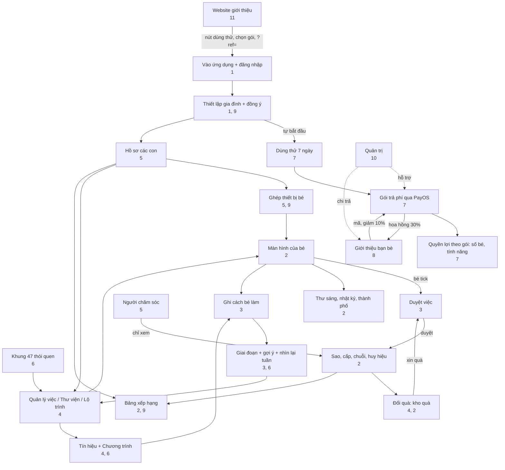

# 12. Carte des liens et scénarios

[← 11. Site web et pages publiques](11-website-va-trang-cong-khai.md) · [Sommaire](README.md) · [Suivant : 13. Glossaire →](13-thuat-ngu.md)

<!--op-->## Dans ce document

[Carte des liens](#ban-do) · [Matrice des dépendances](#phu-thuoc) · [Parcours de bout en bout](#hanh-trinh) · [Une journée type](#mot-ngay) · [Résolution des problèmes](#su-co) · [À consulter également](#lien-quan)<!--/op-->

Ce document montre **comment les fonctionnalités sont reliées** : de quelles autres fonctionnalités elles dépendent, comment les données circulent et quelles fonctionnalités un utilisateur parcourt dans une situation réelle.

## Carte des liens

Principaux enseignements du diagramme :

- **Deux boucles quotidiennes** : *tâche → l’enfant la marque comme terminée → le parent l’approuve → étoiles → récompense → demande de récompense → approbation*, et *tâche terminée → enregistrer comment l’enfant l’a réalisée → phases et suggestions → ajuster la tâche*.
- **Le forfait est la porte d’entrée** vers la plupart des espaces parentaux : l’essai et le forfait déterminent le nombre d’enfants et la disponibilité des fonctions de gestion.
- **Le parrainage passe par le paiement** : le code accorde une réduction avant l’achat et un paiement réussi génère une commission.
<!--op-->- **L’administration** est extérieure au parcours familial ; elle intervient uniquement pour les paiements, remboursements et versements.<!--/op-->

## Matrice des dépendances

Lisez chaque ligne de gauche à droite : la fonctionnalité de la première colonne **a besoin des éléments** de la colonne centrale ou les utilise ; elle **produit ou affecte** les éléments de la dernière colonne.

| Fonctionnalité | Nécessite / utilise | Produit / affecte | Voir |
|---|---|---|---|
| Profil d’enfant | Forfait actif ; confirmation du consentement | Étape d’âge, interface selon l’âge, code d’association, plan de tâches adapté à l’âge | [5](05-gia-dinh-va-cai-dat.md#ho-so) |
| Association d’appareil | Profil d’enfant ; (code PIN si défini) | Écran de l’enfant sans compte ; accès à l’appareil révocable | [5](05-gia-dinh-va-cai-dat.md#ghep-thiet-bi) |
| Tâche (activité) | Profil d’enfant ou « Famille » ; peut provenir du cadre, d’un parcours ou de la bibliothèque | Liste des tâches de l’enfant ; points ; approbation éventuellement requise | [4](04-thiet-ke-thoi-quen.md) |
| L’enfant termine une tâche | Tâche ; le serveur accepte les dates d’il y a deux jours à demain | Étoiles (ou approbation en attente), série, badges, journal d’activité | [2](02-man-hinh-be.md#hoan-thanh) |
| Approuver une tâche / récompense | Code PIN s’il est défini | Ajout ou non des étoiles ; récompense : approbation → remise ou restitution des étoiles | [3](03-hom-nay-va-duyet-viec.md#duyet) |
| Étoiles | Tâches confirmées | Échanger des récompenses, construire la ville ; le total gagné ne diminue jamais | [2](02-man-hinh-be.md#sao-cap-chuoi) |
| Badge des 16 portraits | Tâches du cadre (code du cadre) | Badge ; le portrait 16 nécessite les autres portraits | [2](02-man-hinh-be.md#huy-hieu), [6](06-khoa-hoc-thoi-quen.md#chan-dung) |
| Déclencheurs / programmes | Tâches en cours | Phase de l’habitude ; suggestions | [4](04-thiet-ke-thoi-quen.md#chuong-trinh) |
| Enregistrer comment l’enfant a réalisé la tâche | Tâche terminée | Suggestions plus précises ; pas de classement | [3](03-hom-nay-va-duyet-viec.md#muc-ho-tro) |
| Série quotidienne | Tâches confirmées ; jours de pause familiale | Flamme ; rang dans la ligue | [2](02-man-hinh-be.md#sao-cap-chuoi) |
| Pause familiale | Action d’un parent | Masque les rappels de progression, séries et classements ; suspend les rappels de tâches ; ne brise pas la série | [5](05-gia-dinh-va-cai-dat.md#tam-nghi) |
| Classement public | Partage activé et enfant sélectionné | Pseudonyme, score de période, rang | [9](09-bao-mat-va-rieng-tu.md#bxh-cong-khai) |
| Rappel de tâche | Consentement parental ; élément en attente d’approbation ; famille non en pause | Bannière, notification du navigateur | [3](03-hom-nay-va-duyet-viec.md#nhac-viec-ngan) |
| Paiement | Parent, compte connecté, code PIN si défini | Forfait et durée ; courriel de reçu ; commission | [7](07-goi-va-thanh-toan.md#thanh-toan) |
| Coupon | Compte familial | Jours supplémentaires | [7](07-goi-va-thanh-toan.md#coupon) |
| Code de parrainage | Nouvelle famille n’ayant pas payé | 10 % de réduction sur le premier forfait annuel ; commission du parrain | [8](08-gioi-thieu-ban-be.md) |
| Retirer une commission | Adhésion au programme ; code PIN ; au moins 200,000 VND ; fin de la période de retenue | Demande de versement → virement bancaire par l’administration | [8](08-gioi-thieu-ban-be.md#rut-tien) |
| Remboursement | Demande du client auprès de l’assistance | Commission de la commande récupérée ; courriel d’état | [7](07-goi-va-thanh-toan.md#hoan-tien) |
| Aidant | Invitation d’un parent ; connexion Google | Vue de progression en lecture seule | [5](05-gia-dinh-va-cai-dat.md#nguoi-cham-soc) |
| Suppression des données | Propriétaire de la famille ; code PIN ; saisir `DELETE FAMILY` | Supprime enfants, tâches, progression, récompenses et appareils ; irréversible | [9](09-bao-mat-va-rieng-tu.md#xoa-du-lieu) |

## Parcours de bout en bout

### A. Une nouvelle famille, de la découverte de l’application à une routine établie

1. Consultez le [blog](11-website-va-trang-cong-khai.md#blog), le [cadre](11-website-va-trang-cong-khai.md#trang-khung) et la [page des tarifs](11-website-va-trang-cong-khai.md#trang-chinh) du site web. Essayez la [démo](01-bat-dau.md#demo) si vous le souhaitez.
2. Cliquez sur **Essai gratuit de 7 jours** → connectez-vous avec Google → [configurez votre famille](01-bat-dau.md#thiet-lap) (l’essai démarre automatiquement).
3. Créez un [profil d’enfant](05-gia-dinh-va-cai-dat.md#ho-so), chargez six tâches adaptées à l’âge ou choisissez-les dans le [cadre](04-thiet-ke-thoi-quen.md#khung-47). Créez quelques [récompenses](04-thiet-ke-thoi-quen.md#kho-qua).
4. [Associez un appareil](05-gia-dinh-va-cai-dat.md#ghep-thiet-bi) pour votre enfant et définissez un [code PIN](05-gia-dinh-va-cai-dat.md#pin).
5. Choisissez une ou deux tâches et [définissez un déclencheur](04-thiet-ke-thoi-quen.md#chuong-trinh). Chaque jour, votre enfant marque les tâches comme terminées ; vous les [approuvez](03-hom-nay-va-duyet-viec.md#duyet) et formulez des encouragements précis.
6. Chaque semaine, [faites un bilan de 5 minutes](03-hom-nay-va-duyet-viec.md#nhin-lai-tuan) ; utilisez les suggestions pour ajouter une tâche, garder le rythme ou ajuster une tâche.
7. Avant le septième jour, choisissez un [forfait](07-goi-va-thanh-toan.md#cac-goi) pour continuer (vous pouvez saisir un [code de parrainage](08-gioi-thieu-ban-be.md#giam-10) avant le paiement).

### B. Ajouter un deuxième enfant

[Enfants](05-gia-dinh-va-cai-dat.md#ho-so) → Ajouter. Un forfait Famille ou un essai actif est nécessaire (le forfait Un enfant autorise un seul enfant). Chaque enfant dispose de son propre code et appareil ; l’accès à chaque appareil peut être [révoqué](05-gia-dinh-va-cai-dat.md#thiet-bi) séparément.

### C. Votre famille part en voyage ou une personne est malade

Choisissez [Mettre en pause](05-gia-dinh-va-cai-dat.md#tam-nghi) : la série est préservée, les jours manqués ne sont pas comptabilisés et les rappels de tâches sont suspendus. Choisissez Reprendre à votre retour.

### D. Parrainer un proche

Adhérez au [programme](08-gioi-thieu-ban-be.md#tham-gia) → envoyez le lien → votre proche saisit le code et obtient [10 % de réduction](07-goi-va-thanh-toan.md#giam-gia) sur le forfait annuel → il règle son achat → une [commission est retenue pendant 35 jours](08-gioi-thieu-ban-be.md#hoa-hong) → définissez un code PIN et enregistrez vos coordonnées de versement → [demandez un retrait](08-gioi-thieu-ban-be.md#rut-tien) → l’administration [effectue le virement](10-quan-tri-va-van-hanh.md#gioi-thieu-admin).

<!--op-->### E. Un client demande un remboursement

Le client transmet le code de commande dans les 30 jours → l’assistance [ouvre un dossier](10-quan-tri-va-van-hanh.md#phieu-ho-tro) → l’équipe financière approuve → le remboursement est traité manuellement → sa réalisation est confirmée → la [commission](08-gioi-thieu-ban-be.md#hoan-tien-hoa-hong) de la commande est récupérée → le client reçoit un [courriel](07-goi-va-thanh-toan.md#email).<!--/op-->

## Une journée type

| Heure | Enfant | Parents | Remarques |
|---|---|---|---|
| À partir de 07:00 | Lit la [lettre de la mascotte](02-man-hinh-be.md#thu-buoi-sang) | | Une nouvelle lettre chaque jour |
| Matin | Effectue les tâches du matin, se brosse les dents avec le [minuteur](02-man-hinh-be.md#dem-gio) et marque les tâches comme terminées | Reçoivent un [rappel](03-hom-nay-va-duyet-viec.md#nhac-viec-ngan) si une tâche doit être approuvée | Les tâches nécessitant une approbation attendent les parents |
| Soir | Termine les tâches restantes, écrit une [entrée de journal en une phrase](02-man-hinh-be.md#nhat-ky) et consulte les [badges](02-man-hinh-be.md#huy-hieu) | [Approuvent](03-hom-nay-va-duyet-viec.md#duyet), [enregistrent comment l’enfant a procédé](03-hom-nay-va-duyet-viec.md#muc-ho-tro) et l’encouragent précisément | Les étoiles sont ajoutées après l’approbation |
| Fin de semaine | Peut demander une [récompense](02-man-hinh-be.md#qua) | [Font le bilan de la semaine](03-hom-nay-va-duyet-viec.md#nhin-lai-tuan), [impriment le bilan](03-hom-nay-va-duyet-viec.md#thong-ke) et remettent la récompense | Suggestions pour ajuster les tâches |

## Résolution des problèmes

| Symptôme | Cause fréquente | Que faire |
|---|---|---|
| L’enfant termine une tâche et voit **« Échec de l’enregistrement. Veuillez réessayer. »** avec un code entre parenthèses | Vérifiez le code ci-dessous | La carte revient à son état précédent ; réessayez |
| Code `no-child` | Aucun profil d’enfant n’a pu être sélectionné sur cet appareil (corrigé en ouvrant le mode enfant depuis le compte parental) | Rechargez la page ; si le problème persiste, contactez l’assistance en indiquant le code |
| Code `no-session` | L’appareil n’est pas connecté ou n’a pas été associé | Reconnectez-vous en tant que parent ou associez de nouveau l’appareil avec le [code](05-gia-dinh-va-cai-dat.md#ghep-thiet-bi) |
| Code `no-activity` | La tâche vient d’être supprimée ou n’a pas été chargée | Rechargez la page |
| Code `request-401` | La session a expiré | Connectez-vous à nouveau |
| Code `request-403` | Vous n’avez pas l’autorisation ou le code PIN doit être déverrouillé | Saisissez le [code PIN](05-gia-dinh-va-cai-dat.md#pin) ou utilisez le compte approprié |
| Code `request-409` | Le serveur a refusé la modification (par exemple, date hors plage autorisée ou profil ou tâche ne correspondant plus) | Rechargez et choisissez une date proche d’aujourd’hui |
| Code `points-spent` | Les étoiles de cette tâche ont déjà servi à obtenir une récompense ; l’annulation est donc impossible | Conservez la modification ou demandez à un parent d’[ajuster les étoiles](03-hom-nay-va-duyet-viec.md#chinh-sao) |
| Code `error-…` | Erreur réseau ou autre | Vérifiez votre connexion et réessayez |
| Aucune étoile ne s’affiche après avoir terminé une tâche | La tâche nécessite l’approbation d’un parent | [Approuvez-la](03-hom-nay-va-duyet-viec.md#duyet) |
| Le QR code ne peut pas être scanné | L’autorisation d’utiliser l’appareil photo n’a pas été accordée ou la connexion n’utilise pas https | Accordez l’autorisation ou saisissez le code manuellement |
| Le code d’association est refusé | Le code a été renouvelé ou trop de tentatives incorrectes ont été effectuées | Obtenez un nouveau code dans [Enfants](05-gia-dinh-va-cai-dat.md#ghep-thiet-bi) ; si votre accès est limité, patientez quelques minutes |
| Le virement a été effectué, mais le forfait n’apparaît pas | Confirmation PayOS en attente | Patientez quelques minutes et rouvrez `/checkout` ; ne payez pas à nouveau ; contactez l’assistance avec le code de commande ([activation](07-goi-va-thanh-toan.md#kich-hoat)) |
| Impossible d’ajouter un profil d’enfant | Le forfait a expiré ou le forfait Un enfant compte déjà un enfant | Achetez un forfait ou [passez à un autre forfait](07-goi-va-thanh-toan.md#cac-goi) |
| Le champ du code de parrainage est absent | La famille a déjà payé, la période d’enregistrement a expiré ou un code existe déjà | Aucun autre code ne peut être enregistré ([8](08-gioi-thieu-ban-be.md#giam-10)) |
| Impossible de retirer une commission | Aucun code PIN, montant inférieur à 200,000 VND, période de retenue non terminée ou coordonnées de versement modifiées récemment (attente de 24 heures) | Consultez [Demander un retrait](08-gioi-thieu-ban-be.md#rut-tien) |
| L’enfant ne voit pas le classement public | Le partage est désactivé, l’enfant n’a pas été sélectionné ou la famille est en pause | [Activez le partage](05-gia-dinh-va-cai-dat.md#rieng-tu) et sélectionnez l’enfant |
| La série quotidienne est perdue | Plus d’un jour s’est écoulé sans tâche confirmée | Vérifiez de nouveau le décompte ; la [pause](05-gia-dinh-va-cai-dat.md#tam-nghi) pourra vous aider la prochaine fois |
| Le courriel de connexion ou de cycle de vie n’arrive pas | Il se trouve dans les courriers indésirables ; l’adresse a déjà refusé un message ; la connexion par code électronique est désactivée | Vérifiez les courriers indésirables ; utilisez Google |
| L’appareil de l’enfant a été perdu | Il faut en bloquer l’accès | [Révoquez l’appareil](05-gia-dinh-va-cai-dat.md#thiet-bi) et renouvelez le code |

Lorsque vous contactez l’assistance ([Contact](11-website-va-trang-cong-khai.md#trang-chinh)), indiquez le code d’assistance, l’heure et l’action que vous venez d’effectuer. **N’envoyez pas** de mots de passe, codes PIN ni codes d’association encore valides.

## À consulter également

[Sommaire](README.md) · [Glossaire](13-thuat-ngu.md) · [Confidentialité et sécurité](09-bao-mat-va-rieng-tu.md)<!--op--> · [Administration et opérations](10-quan-tri-va-van-hanh.md)<!--/op-->
