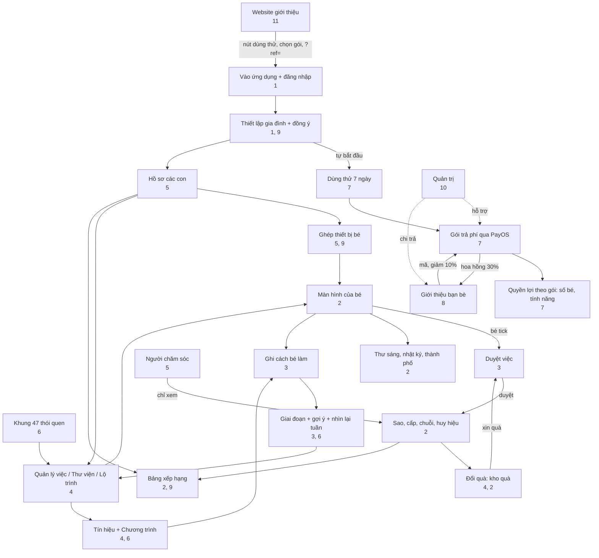

# 12. Mappa dei collegamenti e scenari

[← 11. Sito web e pagine pubbliche](11-website-va-trang-cong-khai.md) · [Indice](README.md) · [Avanti: 13. Glossario →](13-thuat-ngu.md)

<!--op-->## In questo documento

[Mappa dei collegamenti](#ban-do) · [Matrice delle dipendenze](#phu-thuoc) · [Percorsi completi](#hanh-trinh) · [Una giornata tipo](#mot-ngay) · [Risoluzione dei problemi](#su-co) · [Argomenti correlati](#lien-quan)<!--/op-->

Questo documento mostra **come si collegano le funzioni**: da quali altre funzioni dipendono, come fluiscono i dati e quali funzioni attraversa un utente in uno scenario reale.

## Mappa dei collegamenti

Punti principali del diagramma:

- **Due cicli quotidiani**: *attività → il bambino la contrassegna come completata → il genitore approva → stelle → premio → richiesta del premio → approvazione* e *contrassegnare come completata → registrare come l'ha svolta il bambino → fase e suggerimenti → modificare l'attività*.
- **Il piano è il punto di accesso** alla maggior parte delle aree per genitori: la prova e il piano determinano il numero di bambini e la disponibilità delle funzioni di gestione.
- **Gli inviti** passano dal pagamento: il codice offre uno sconto prima dell'acquisto e un pagamento riuscito genera una commissione.
<!--op-->- **L'amministrazione** è esterna al flusso della famiglia e si occupa solo di pagamenti, rimborsi e liquidazioni.<!--/op-->

## Matrice delle dipendenze

Legga ogni riga da sinistra a destra: la funzione nella prima colonna **richiede o usa** gli elementi della colonna centrale e **produce o influenza** quelli dell'ultima colonna.

| Funzione | Richiede / usa | Produce / influenza | Vedere |
|---|---|---|---|
| Profilo del bambino | Piano attivo; conferma del consenso | Fascia d'età, interfaccia in base all'età, codice di abbinamento, piano di attività per età | [5](05-gia-dinh-va-cai-dat.md#ho-so) |
| Abbinamento del dispositivo | Profilo del bambino; (PIN, se impostato) | Schermata del bambino senza account; accesso del dispositivo revocabile | [5](05-gia-dinh-va-cai-dat.md#ghep-thiet-bi) |
| Attività | Profilo del bambino o «Family»; può provenire da una struttura, un percorso o una raccolta | Elenco delle attività del bambino; punti; possibile approvazione richiesta | [4](04-thiet-ke-thoi-quen.md) |
| Il bambino contrassegna un'attività come completata | Attività; il server accetta date da due giorni fa a domani | Stelle (o approvazione in attesa), serie, distintivi, diario delle attività | [2](02-man-hinh-be.md#hoan-thanh) |
| Approvazione di attività / premio | PIN, se impostato | Stelle aggiunte o meno; premio: approvazione → consegna o restituzione delle stelle | [3](03-hom-nay-va-duyet-viec.md#duyet) |
| Stelle | Attività confermate | Riscatto dei premi, costruzione della città; il totale guadagnato non diminuisce mai | [2](02-man-hinh-be.md#sao-cap-chuoi) |
| Distintivo dei 16 profili | Attività della struttura (codice della struttura) | Distintivo; il profilo 16 richiede gli altri profili | [2](02-man-hinh-be.md#huy-hieu), [6](06-khoa-hoc-thoi-quen.md#chan-dung) |
| Segnali / programmi | Attività attualmente in uso | Fase dell'abitudine; suggerimenti | [4](04-thiet-ke-thoi-quen.md#chuong-trinh) |
| Registrazione del modo in cui il bambino ha svolto l'attività | Attività completata | Suggerimenti più precisi; non viene usata per le classifiche | [3](03-hom-nay-va-duyet-viec.md#muc-ho-tro) |
| Serie giornaliera | Attività confermate; giorni di pausa della famiglia | Fiamma; posizione in lega | [2](02-man-hinh-be.md#sao-cap-chuoi) |
| Pausa della famiglia | Azione del genitore | Nasconde i prompt sui progressi, le serie e le classifiche; sospende i promemoria delle attività; non interrompe la serie | [5](05-gia-dinh-va-cai-dat.md#tam-nghi) |
| Classifica pubblica | Condivisione attiva + bambino selezionato | Soprannome, punteggio del periodo, posizione | [9](09-bao-mat-va-rieng-tu.md#bxh-cong-khai) |
| Promemoria di un'attività | Consenso del genitore; attività in attesa di approvazione; famiglia non in pausa | Banner, notifica del browser | [3](03-hom-nay-va-duyet-viec.md#nhac-viec-ngan) |
| Pagamento | Genitore, account connesso, PIN se impostato | Piano + durata; e-mail di ricevuta; commissione | [7](07-goi-va-thanh-toan.md#thanh-toan) |
| Coupon | Account della famiglia | Giorni aggiuntivi | [7](07-goi-va-thanh-toan.md#coupon) |
| Codice invito | Famiglia nuova che non ha pagato | Sconto del 10% sul primo piano annuale; commissione per chi invita | [8](08-gioi-thieu-ban-be.md) |
| Prelievo della commissione | Iscrizione al programma; PIN; almeno 200,000 VND; periodo di attesa terminato | Richiesta di pagamento → bonifico bancario dell'amministrazione | [8](08-gioi-thieu-ban-be.md#rut-tien) |
| Rimborso | Richiesta del cliente tramite un caso di assistenza | Recupero della commissione di quell'ordine; e-mail di stato | [7](07-goi-va-thanh-toan.md#hoan-tien) |
| Persona che si prende cura del bambino | Invito del genitore; accesso Google | Visualizzazione dei progressi in sola lettura | [5](05-gia-dinh-va-cai-dat.md#nguoi-cham-soc) |
| Eliminazione dei dati | Proprietario della famiglia; PIN; inserire `DELETE FAMILY` | Elimina bambini, attività, progressi, premi e dispositivi; operazione irreversibile | [9](09-bao-mat-va-rieng-tu.md#xoa-du-lieu) |

## Percorsi completi

### A. Una nuova famiglia: dalla scoperta dell'app a una routine stabile

1. Legga il [blog](11-website-va-trang-cong-khai.md#blog), la [struttura](11-website-va-trang-cong-khai.md#trang-khung) e la [pagina dei prezzi](11-website-va-trang-cong-khai.md#trang-chinh) sul sito. Se vuole, provi la [demo](01-bat-dau.md#demo).
2. Faccia clic su **7-Day Free Trial** → acceda con Google → [configuri la famiglia](01-bat-dau.md#thiet-lap) (la prova inizia automaticamente).
3. Crei un [profilo bambino](05-gia-dinh-va-cai-dat.md#ho-so), carichi sei attività basate sull'età oppure scelga dalla [struttura](04-thiet-ke-thoi-quen.md#khung-47). Crei alcuni [premi](04-thiet-ke-thoi-quen.md#kho-qua).
4. [Abbini un dispositivo](05-gia-dinh-va-cai-dat.md#ghep-thiet-bi) per il bambino e imposti un [PIN](05-gia-dinh-va-cai-dat.md#pin).
5. Scelga una o due attività e [imposti un segnale](04-thiet-ke-thoi-quen.md#chuong-trinh). Ogni giorno il bambino contrassegna le attività come completate, Lei le [approva](03-hom-nay-va-duyet-viec.md#duyet) e gli rivolge un apprezzamento specifico.
6. Ogni settimana, dedichi [5 minuti al riepilogo](03-hom-nay-va-duyet-viec.md#nhin-lai-tuan); usi i suggerimenti per aggiungere un'attività, mantenere il ritmo o modificarne una.
7. Prima del settimo giorno, scelga un [piano](07-goi-va-thanh-toan.md#cac-goi) per continuare (può inserire un [codice invito](08-gioi-thieu-ban-be.md#giam-10) prima di pagare).

### B. Aggiungere un secondo bambino

[Bambini](05-gia-dinh-va-cai-dat.md#ho-so) → Aggiungi. È necessario un piano Family o una prova attiva (il piano Single Child consente fino a 1 bambino). Ogni bambino ha un codice e un dispositivo separati; ogni dispositivo può essere [revocato](05-gia-dinh-va-cai-dat.md#thiet-bi) singolarmente.

### C. La famiglia è fuori casa o qualcuno è malato

Scelga [Fai una pausa](05-gia-dinh-va-cai-dat.md#tam-nghi): la serie viene mantenuta, i giorni saltati non vengono conteggiati e i promemoria delle attività si interrompono. Al ritorno, scelga Riprendi.

### D. Invitare un amico

Si iscriva al [programma](08-gioi-thieu-ban-be.md#tham-gia) → invii il link → l'amico inserisce il codice e riceve il [10% di sconto](07-goi-va-thanh-toan.md#giam-gia) acquistando il piano annuale → l'amico paga → la Sua [commissione resta in attesa per 35 giorni](08-gioi-thieu-ban-be.md#hoa-hong) → imposti un PIN e salvi i dati di pagamento → [richieda un prelievo](08-gioi-thieu-ban-be.md#rut-tien) → l'amministrazione [trasferisce l'importo](10-quan-tri-va-van-hanh.md#gioi-thieu-admin).

<!--op-->### E. Un cliente richiede un rimborso

Il cliente invia il codice dell'ordine entro 30 giorni → l'assistenza [apre un caso](10-quan-tri-va-van-hanh.md#phieu-ho-tro) → l'ufficio amministrativo approva → il rimborso viene elaborato manualmente → la conclusione viene confermata → la [commissione](08-gioi-thieu-ban-be.md#hoan-tien-hoa-hong) dell'ordine viene recuperata → il cliente riceve un'[e-mail](07-goi-va-thanh-toan.md#email).<!--/op-->

## Una giornata tipo

| Orario | Bambino | Genitori | Note |
|---|---|---|---|
| Dalle 07:00 | Legge la [lettera della mascotte](02-man-hinh-be.md#thu-buoi-sang) | | Ogni giorno una nuova lettera |
| Mattina | Svolge le attività del mattino, [cronometra](02-man-hinh-be.md#dem-gio) il lavaggio dei denti e contrassegna le attività come completate | Ricevono un [promemoria](03-hom-nay-va-duyet-viec.md#nhac-viec-ngan) se un'attività richiede approvazione | Le attività da approvare attendono i genitori |
| Sera | Completa le attività rimanenti, scrive una [voce di diario di una frase](02-man-hinh-be.md#nhat-ky) e vede i [distintivi](02-man-hinh-be.md#huy-hieu) | [Approvano](03-hom-nay-va-duyet-viec.md#duyet), [registrano come il bambino ha svolto l'attività](03-hom-nay-va-duyet-viec.md#muc-ho-tro) e gli rivolgono un apprezzamento specifico | Le stelle vengono aggiunte dopo l'approvazione |
| Fine settimana | Può chiedere un [premio](02-man-hinh-be.md#qua) | [Rivedono la settimana](03-hom-nay-va-duyet-viec.md#nhin-lai-tuan), [la stampano](03-hom-nay-va-duyet-viec.md#thong-ke) e consegnano il premio | Suggerimenti per modificare le attività |

## Risoluzione dei problemi

| Sintomo | Causa comune | Cosa fare |
|---|---|---|
| Il bambino contrassegna un'attività come completata e vede **«Impossibile salvare. Riprovi.»** con un codice tra parentesi | Verifichi il codice qui sotto | La scheda torna allo stato precedente; riprovi |
| Codice `no-child` | Non è stato possibile selezionare un profilo bambino su questo dispositivo (si risolve aprendo Kid Mode dall'account del genitore) | Ricarichi la pagina; se il problema persiste, contatti l'assistenza indicando il codice |
| Codice `no-session` | Il dispositivo non ha effettuato l'accesso o non è stato abbinato | Acceda di nuovo come genitore oppure abbini di nuovo il dispositivo del bambino con il [codice](05-gia-dinh-va-cai-dat.md#ghep-thiet-bi) |
| Codice `no-activity` | L'attività è stata appena eliminata o non è stata caricata | Ricarichi la pagina |
| Codice `request-401` | La sessione è scaduta | Acceda di nuovo |
| Codice `request-403` | Non dispone dell'autorizzazione oppure il PIN deve essere sbloccato | Inserisca il [PIN](05-gia-dinh-va-cai-dat.md#pin) o usi l'account corretto |
| Codice `request-409` | Il server ha rifiutato la modifica (per esempio, una data fuori dall'intervallo consentito oppure un profilo o un'attività non più corrispondenti) | Ricarichi e scelga una data vicina a oggi |
| Codice `points-spent` | Le stelle di questa attività sono già state spese per un premio, quindi la modifica non può essere annullata | Lasci tutto com'è oppure chieda a un genitore di [modificare le stelle](03-hom-nay-va-duyet-viec.md#chinh-sao) |
| Codice `error-…` | Errore di rete o di altro tipo | Controlli la connessione e riprovi |
| Dopo aver contrassegnato un'attività come completata, **non compaiono stelle** | L'attività richiede l'approvazione di un genitore | [La approvi](03-hom-nay-va-duyet-viec.md#duyet) |
| Impossibile scansionare il codice QR | Non è stato concesso il permesso di usare la fotocamera oppure la connessione non usa https | Conceda il permesso o inserisca il codice manualmente |
| Codice di abbinamento rifiutato | Il codice è stato aggiornato oppure sono stati effettuati troppi tentativi errati | Richieda un nuovo codice da [Bambini](05-gia-dinh-va-cai-dat.md#ghep-thiet-bi); attenda qualche minuto se è stata applicata la limitazione della frequenza |
| Pagamento trasferito ma il piano non appare | In attesa della conferma di PayOS | Attenda qualche minuto e riapra `/checkout`; non paghi di nuovo; contatti l'assistenza indicando il codice dell'ordine ([attivazione](07-goi-va-thanh-toan.md#kich-hoat)) |
| Impossibile aggiungere un profilo bambino | Il piano è scaduto oppure il piano Single Child ha già 1 bambino | Acquisti un piano o [effettui l'upgrade](07-goi-va-thanh-toan.md#cac-goi) |
| Manca il campo del codice invito | La famiglia ha già pagato, il periodo per la registrazione è scaduto oppure esiste già un codice | Non è possibile registrare un altro codice ([8](08-gioi-thieu-ban-be.md#giam-10)) |
| Impossibile prelevare la commissione | PIN non impostato, importo inferiore a 200,000 VND, periodo di attesa non terminato oppure dati di pagamento modificati da poco (attesa di 24 ore) | Veda [richiesta di prelievo](08-gioi-thieu-ban-be.md#rut-tien) |
| Il bambino non vede la classifica pubblica | La condivisione è disattivata, il bambino non è stato selezionato oppure la famiglia è in pausa | [Attivi la condivisione](05-gia-dinh-va-cai-dat.md#rieng-tu) e selezioni il bambino |
| La serie giornaliera è stata interrotta | È passato più di un giorno senza un'attività confermata | Controlli di nuovo il conteggio; [fare una pausa](05-gia-dinh-va-cai-dat.md#tam-nghi) può essere utile la prossima volta |
| L'e-mail di accesso o del ciclo di vita non arriva | È finita nello spam; l'indirizzo aveva già respinto messaggi; l'accesso con codice e-mail è disattivato | Controlli lo spam; usi Google |
| Il dispositivo del bambino è stato smarrito | È necessario bloccarne l'accesso | [Revochi il dispositivo](05-gia-dinh-va-cai-dat.md#thiet-bi) e aggiorni il codice |

Quando contatta l'assistenza ([Contatti](11-website-va-trang-cong-khai.md#trang-chinh)): invii il codice di assistenza, l'orario e l'azione appena eseguita. **Non invii** password, PIN o codici di abbinamento ancora validi.

## Argomenti correlati

[Indice](README.md) · [Glossario](13-thuat-ngu.md) · [Privacy e sicurezza](09-bao-mat-va-rieng-tu.md)<!--op--> · [Amministrazione e operazioni](10-quan-tri-va-van-hanh.md)<!--/op-->
