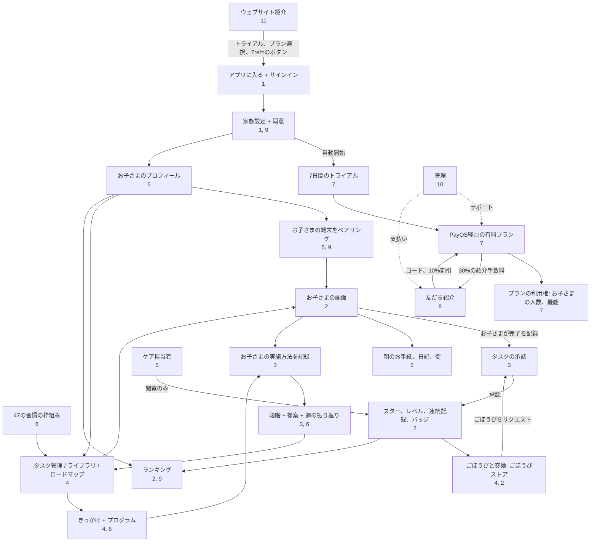

# 12. 関連マップと利用シナリオ

[← 11. ウェブサイトと公開ページ](11-website-va-trang-cong-khai.md) · [目次](README.md) · [次へ: 13. 用語集 →](13-thuat-ngu.md)

<!--op-->## この文書の内容

[関連マップ](#ban-do) · [依存関係マトリクス](#phu-thuoc) · [最初から最後までの利用シナリオ](#hanh-trinh) · [よくある一日](#mot-ngay) · [トラブルシューティング](#su-co) · [関連項目](#lien-quan)<!--/op-->

この文書では、**機能同士のつながり**を示します。どの機能が別の機能に依存するか、データがどのように流れるか、実際の利用場面でユーザーがどの機能を使うかを説明します。

## 関連マップ

図の要点:

- **日々の2つの流れ**: *タスク → お子さまが完了を記録 → 保護者が承認 → スター → ごほうび → ごほうびのリクエスト → 承認*、および*完了を記録 → お子さまの実施方法を記録 → 段階と提案 → タスクを調整*。
- **プランが保護者エリアの多くの機能への入口**です。トライアルとプランによって、お子さまの人数と管理機能の利用可否が決まります。
- **紹介は支払いに連動**します。購入前にコードで割引が適用され、支払いが成功すると紹介手数料が発生します。
<!--op-->- **管理機能**は家族の流れとは別で、支払い、返金、出金をサポートします。<!--/op-->

## 依存関係マトリクス

各行を左から右に読みます。1列目の機能が中央列の項目を**必要とする／使用する**と、右列の項目を**生み出す／影響する**ことを示します。

| 機能 | 必要なもの／使用するもの | 生み出すもの／影響 | 参照先 |
|---|---|---|---|
| お子さまのプロフィール | 有効なプラン、データ管理への同意 | 年齢段階、年齢に合わせた画面、ペアリングコード、年齢別タスクプラン | [5](05-gia-dinh-va-cai-dat.md#ho-so) |
| 端末のペアリング | お子さまのプロフィール、（設定している場合はPIN） | アカウントなしでお子さまの画面を利用。端末アクセスの解除も可能 | [5](05-gia-dinh-va-cai-dat.md#ghep-thiet-bi) |
| タスク（行動） | お子さまのプロフィールまたは「家族」。枠組み、ロードマップ、ライブラリから追加される場合もあります | お子さまのタスク一覧、ポイント、承認が必要になる場合があります | [4](04-thiet-ke-thoi-quen.md) |
| お子さまがタスクを完了 | タスク。サーバーは今日の2日前から明日までの日付を受け付けます | スター（または承認待ち）、連続記録、バッジ、行動日記 | [2](02-man-hinh-be.md#hoan-thanh) |
| タスク／ごほうびの承認 | 設定している場合はPIN | スターの付与、または付与なし。ごほうびは承認後に渡すか、スターを返却 | [3](03-hom-nay-va-duyet-viec.md#duyet) |
| スター | 確認済みのタスク | ごほうびとの交換、街づくり。獲得合計は減りません | [2](02-man-hinh-be.md#sao-cap-chuoi) |
| 16の肖像バッジ | 枠組みコード付きの枠組み由来のタスク | バッジ。16番目の肖像にはほかの肖像が必要です | [2](02-man-hinh-be.md#huy-hieu)、[6](06-khoa-hoc-thoi-quen.md#chan-dung) |
| きっかけ／プログラム | 使用中のタスク | 習慣の段階、提案 | [4](04-thiet-ke-thoi-quen.md#chuong-trinh) |
| お子さまの実施方法を記録 | 完了したタスク | より正確な提案。ランキングには使用されません | [3](03-hom-nay-va-duyet-viec.md#muc-ho-tro) |
| 日ごとの連続記録 | 確認済みのタスク、家族の休憩日 | 炎、リーグランク | [2](02-man-hinh-be.md#sao-cap-chuoi) |
| 家族の休憩 | 保護者の操作 | 進捗メッセージ、連続記録、ランキングを非表示にし、タスクリマインダーを一時停止。連続記録は途切れません | [5](05-gia-dinh-va-cai-dat.md#tam-nghi) |
| 公開ランキング | 共有を有効化し、お子さまを選択 | ニックネーム、期間スコア、順位 | [9](09-bao-mat-va-rieng-tu.md#bxh-cong-khai) |
| タスクリマインダー | 保護者の同意、承認待ちの項目、家族が休憩中でないこと | バナー、ブラウザー通知 | [3](03-hom-nay-va-duyet-viec.md#nhac-viec-ngan) |
| 支払い | 保護者、サインイン済みアカウント、設定している場合はPIN | プランと期間、領収書メール、紹介手数料 | [7](07-goi-va-thanh-toan.md#thanh-toan) |
| クーポン | 家族アカウント | 追加日数 | [7](07-goi-va-thanh-toan.md#coupon) |
| 紹介コード | 支払いをしていない新しい家族 | 初回の年払いプランが10%割引、紹介者に紹介手数料 | [8](08-gioi-thieu-ban-be.md) |
| 紹介手数料の出金 | プログラムへの参加、PIN、200,000 VND以上、保留期間の終了 | 出金申請 → 管理者による銀行振込 | [8](08-gioi-thieu-ban-be.md#rut-tien) |
| 返金 | お客様の依頼によるサポート対応 | 注文の紹介手数料を回収、状態メール | [7](07-goi-va-thanh-toan.md#hoan-tien) |
| ケア担当者 | 保護者の招待、Googleでのサインイン | 読み取り専用の進捗画面 | [5](05-gia-dinh-va-cai-dat.md#nguoi-cham-soc) |
| データの削除 | 家族の所有者、PIN、`DELETE FAMILY`の入力 | お子さま、タスク、進捗、ごほうび、端末を削除。元に戻せません | [9](09-bao-mat-va-rieng-tu.md#xoa-du-lieu) |

## 最初から最後までの利用シナリオ

### A. アプリを知るところから習慣が定着するまで

1. ウェブサイトの[ブログ](11-website-va-trang-cong-khai.md#blog)、[枠組み](11-website-va-trang-cong-khai.md#trang-khung)、[料金ページ](11-website-va-trang-cong-khai.md#trang-chinh)を読みます。ご希望に応じて[デモ](01-bat-dau.md#demo)を試してください。
2. **7日間の無料トライアル**をクリック → Googleでサインイン → [家族を設定](01-bat-dau.md#thiet-lap)（トライアルは自動で開始します）。
3. [お子さまのプロフィール](05-gia-dinh-va-cai-dat.md#ho-so)を作成し、年齢に合わせた6つのタスクを読み込むか、[枠組み](04-thiet-ke-thoi-quen.md#khung-47)から選びます。[ごほうび](04-thiet-ke-thoi-quen.md#kho-qua)もいくつか作成します。
4. お子さまの端末を[ペアリング](05-gia-dinh-va-cai-dat.md#ghep-thiet-bi)し、[PIN](05-gia-dinh-va-cai-dat.md#pin)を設定します。
5. タスクを1～2個選んで[きっかけを設定](04-thiet-ke-thoi-quen.md#chuong-trinh)します。毎日、お子さまが完了を記録し、保護者が[承認](03-hom-nay-va-duyet-viec.md#duyet)して具体的にほめます。
6. 毎週、5分ほど[振り返り](03-hom-nay-va-duyet-viec.md#nhin-lai-tuan)、提案を参考にタスクを追加、継続、調整します。
7. 7日目までに、続けるための[プラン](07-goi-va-thanh-toan.md#cac-goi)を選びます（支払い前に[紹介コード](08-gioi-thieu-ban-be.md#giam-10)を入力できます）。

### B. 2人目のお子さまを追加する

[お子さま](05-gia-dinh-va-cai-dat.md#ho-so) → 追加。ファミリープランまたは有効なトライアルが必要です（ベーシックプランは1人まで）。お子さまごとに別のコードと端末があり、端末ごとに個別に[連携を解除](05-gia-dinh-va-cai-dat.md#thiet-bi)できます。

### C. 家族で外出する場合や、誰かが病気のとき

[休憩を取る](05-gia-dinh-va-cai-dat.md#tam-nghi)を選びます。連続記録は維持され、休憩日は未実施として数えず、タスクリマインダーは停止します。戻ったら再開を選択します。

### D. 友だちを紹介する

[プログラム](08-gioi-thieu-ban-be.md#tham-gia)に参加 → リンクを送信 → 友だちがコードを入力して年払いプランを購入すると[10%割引](07-goi-va-thanh-toan.md#giam-gia) → 友だちが支払い → [35日間保留](08-gioi-thieu-ban-be.md#hoa-hong)の紹介手数料が発生 → PINを設定して出金先を保存 → [出金を申請](08-gioi-thieu-ban-be.md#rut-tien) → 管理者が[振込](10-quan-tri-va-van-hanh.md#gioi-thieu-admin)。

<!--op-->### E. お客様が返金を依頼する

お客様が30日以内に注文コードを送信 → サポートが[依頼を登録](10-quan-tri-va-van-hanh.md#phieu-ho-tro) → 経理が承認 → 手動で返金を処理 → 完了を確認 → 注文の[紹介手数料](08-gioi-thieu-ban-be.md#hoan-tien-hoa-hong)を回収 → お客様に[メール](07-goi-va-thanh-toan.md#email)が届きます。<!--/op-->

## よくある一日

| 時間 | お子さま | 保護者 | 備考 |
|---|---|---|---|
| 07:00以降 | [マスコットの手紙](02-man-hinh-be.md#thu-buoi-sang)を読む | | 毎日新しい手紙が届きます |
| 朝 | 朝のタスク、[時間を計る](02-man-hinh-be.md#dem-gio)歯みがきを行い、タスクを完了にする | 承認が必要なタスクがある場合は[リマインダー](03-hom-nay-va-duyet-viec.md#nhac-viec-ngan)を受け取る | 承認が必要なタスクは保護者の対応を待ちます |
| 夜 | 残りのタスクを終え、[1文日記](02-man-hinh-be.md#nhat-ky)を書き、[バッジ](02-man-hinh-be.md#huy-hieu)を確認する | [承認](03-hom-nay-va-duyet-viec.md#duyet)、[お子さまの実施方法を記録](03-hom-nay-va-duyet-viec.md#muc-ho-tro)し、具体的にほめる | 承認時にスターが加算されます |
| 週末 | [ごほうび](02-man-hinh-be.md#qua)をリクエストする場合があります | [週を振り返り](03-hom-nay-va-duyet-viec.md#nhin-lai-tuan)、[週間レポートを印刷](03-hom-nay-va-duyet-viec.md#thong-ke)して、ごほうびを渡す | タスク調整の提案を確認します |

## トラブルシューティング

| 症状 | 主な原因 | 対処方法 |
|---|---|---|
| お子さまがタスクを完了にすると、括弧付きコードとともに**「保存できませんでした。もう一度お試しください。」**と表示される | 下のコードを確認 | カードは元の状態に戻ります。もう一度お試しください |
| コード`no-child` | この端末でお子さまのプロフィールを選択できませんでした（保護者アカウントからキッズモードを開くと解決します） | ページを再読み込みします。続く場合はコードを添えてサポートに連絡します |
| コード`no-session` | 端末がサインインまたはペアリングされていません | 保護者としてサインインし直すか、お子さまの端末で[コード](05-gia-dinh-va-cai-dat.md#ghep-thiet-bi)を使い再度ペアリングします |
| コード`no-activity` | タスクが削除されたばかり、または読み込まれていません | ページを再読み込みします |
| コード`request-401` | セッションの期限切れ | もう一度サインインします |
| コード`request-403` | 権限がないか、PINのロック解除が必要です | [PIN](05-gia-dinh-va-cai-dat.md#pin)を入力するか、正しいアカウントを使います |
| コード`request-409` | サーバーが変更を拒否しました（許可範囲外の日付、プロフィールやタスクの不一致など） | 再読み込みして、今日に近い日付を選択します |
| コード`points-spent` | このタスクのスターをごほうびに使用済みのため、変更を取り消せません | そのままにするか、保護者に[スターを調整](03-hom-nay-va-duyet-viec.md#chinh-sao)してもらいます |
| コード`error-…` | ネットワークまたはその他のエラー | 接続を確認して再試行します |
| タスクを完了にしても**スターが表示されない** | 保護者の承認が必要です | [承認](03-hom-nay-va-duyet-viec.md#duyet)します |
| QRコードを読み取れない | カメラの使用が許可されていないか、https接続ではありません | カメラを許可するか、コードを手入力します |
| ペアリングコードが拒否される | コードが更新されたか、入力間違いが多すぎます | [お子さま](05-gia-dinh-va-cai-dat.md#ghep-thiet-bi)から新しいコードを取得します。レート制限中の場合は数分待ちます |
| 振込後もプランが表示されない | PayOSの確認待ち | 数分待ってから`/checkout`を再度開きます。再度支払わず、注文コードを添えてサポートに連絡します（[有効化](07-goi-va-thanh-toan.md#kich-hoat)） |
| お子さまのプロフィールを追加できない | プランの期限切れ、またはベーシックプランですでに1人登録済み | プランを購入または[アップグレード](07-goi-va-thanh-toan.md#cac-goi)します |
| 紹介コード欄が見つからない | 家族がすでに支払い済み、記録期間の終了、またはコード登録済み | 追加のコードは登録できません（[8](08-gioi-thieu-ban-be.md#giam-10)） |
| 紹介手数料を出金できない | PIN未設定、200,000 VND未満、保留期間中、または振込先の変更直後（24時間待ち） | [出金申請](08-gioi-thieu-ban-be.md#rut-tien)をご覧ください |
| お子さまに公開ランキングが表示されない | 共有がオフ、お子さまが選択されていない、または家族が休憩中 | [共有を有効にし](05-gia-dinh-va-cai-dat.md#rieng-tu)、お子さまを選択します |
| 日ごとの連続記録が失われた | 確認済みタスクなしで1日以上経過 | 日数を確認します。次回は[休憩](05-gia-dinh-va-cai-dat.md#tam-nghi)を活用できます |
| サインインまたはライフサイクルメールが届かない | 迷惑メールに入った、以前に配信エラーとなった、メールコードでのサインインが無効 | 迷惑メールを確認し、Googleを使います |
| お子さまの端末を紛失した | アクセスをブロックする必要があります | [端末の連携を解除](05-gia-dinh-va-cai-dat.md#thiet-bi)し、コードを更新します |

サポートへの連絡（[連絡先](11-website-va-trang-cong-khai.md#trang-chinh)）には、サポートコード、時刻、直前に行った操作をお知らせください。パスワード、PIN、有効期限内のペアリングコードは**送らないでください**。

## 関連項目

[目次](README.md) · [用語集](13-thuat-ngu.md) · [プライバシーとセキュリティ](09-bao-mat-va-rieng-tu.md)<!--op--> · [管理と運用](10-quan-tri-va-van-hanh.md)<!--/op-->
