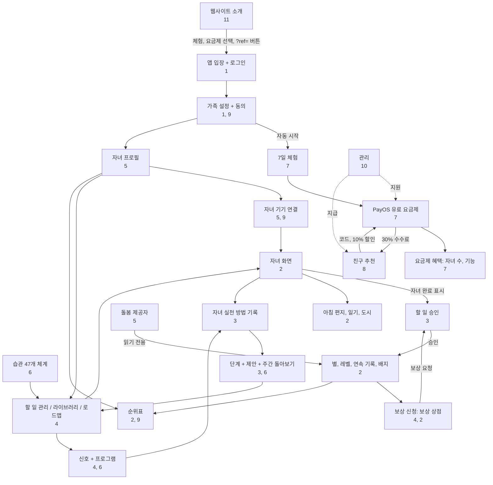

# 12. 연결 지도 및 시나리오

[← 11. 웹사이트 및 공개 페이지](11-website-va-trang-cong-khai.md) · [목차](README.md) · [다음: 13. 용어집 →](13-thuat-ngu.md)

<!--op-->## 이 문서의 내용

[연결 지도](#ban-do) · [의존성 표](#phu-thuoc) · [처음부터 끝까지의 여정](#hanh-trinh) · [일반적인 하루](#mot-ngay) · [문제 해결](#su-co) · [관련 항목](#lien-quan)<!--/op-->

이 문서는 **기능이 서로 어떻게 연결되는지** 보여 줍니다. 어떤 기능이 다른 기능에 의존하는지, 데이터가 어떻게 흐르는지, 사용자가 실제 상황에서 어떤 기능을 이용하는지 설명합니다.

## 연결 지도

다이어그램의 주요 내용:

- **매일 진행되는 두 흐름**: *할 일 → 자녀 완료 표시 → 부모 승인 → 별 → 보상 → 보상 요청 → 승인* 및 *완료 표시 → 자녀 실천 방법 기록 → 단계 및 제안 → 할 일 조정*.
- **요금제가 관문 역할**을 합니다. 체험과 요금제에 따라 자녀 수와 관리 기능 이용 여부가 정해집니다.
- **추천**은 결제 과정을 통합니다. 구매 전에 코드로 할인을 적용하고 결제가 완료되면 수수료가 발생합니다.
<!--op-->- **관리자**는 가족 흐름과 분리되어 있으며 결제, 환불 및 지급만 지원합니다.<!--/op-->

## 의존성 표

각 행을 왼쪽에서 오른쪽으로 읽으세요. 첫 열의 기능이 가운데 항목을 **필요로 하거나 사용하고**, 마지막 열의 항목을 **만들거나 변경합니다**.

| 기능 | 필요 항목 / 사용 항목 | 생성 항목 / 영향 | 참조 |
|---|---|---|---|
| 자녀 프로필 | 활성 요금제, 동의 확인 | 연령 단계, 연령별 인터페이스, 연결 코드, 연령별 할 일 계획 | [5](05-gia-dinh-va-cai-dat.md#ho-so) |
| 기기 연결 | 자녀 프로필, (설정 시 PIN) | 계정 없는 자녀 화면, 기기 접근 해제 가능 | [5](05-gia-dinh-va-cai-dat.md#ghep-thiet-bi) |
| 할 일(활동) | 자녀 프로필 또는 “가족”; 체계, 로드맵, 라이브러리에서 가져올 수 있음 | 자녀 할 일 목록, 포인트, 승인 필요 가능 | [4](04-thiet-ke-thoi-quen.md) |
| 자녀의 할 일 완료 표시 | 할 일, 서버에서 허용하는 날짜(그제부터 내일까지) | 별(또는 승인 대기), 연속 기록, 배지, 활동 일지 | [2](02-man-hinh-be.md#hoan-thanh) |
| 할 일 / 보상 승인 | 설정된 경우 PIN | 별 지급 여부, 보상 승인 후 전달 또는 별 반환 | [3](03-hom-nay-va-duyet-viec.md#duyet) |
| 별 | 확인된 할 일 | 보상 신청, 도시 건설. 총 획득 별은 감소하지 않음 | [2](02-man-hinh-be.md#sao-cap-chuoi) |
| 초상 배지 16개 | 체계의 할 일(체계 코드) | 배지. 초상 16은 나머지 초상이 필요 | [2](02-man-hinh-be.md#huy-hieu), [6](06-khoa-hoc-thoi-quen.md#chan-dung) |
| 단서 / 프로그램 | 사용 중인 할 일 | 습관 단계, 제안 | [4](04-thiet-ke-thoi-quen.md#chuong-trinh) |
| 자녀의 실천 방법 기록 | 완료한 할 일 | 더 정확한 제안. 순위에 사용하지 않음 | [3](03-hom-nay-va-duyet-viec.md#muc-ho-tro) |
| 일별 연속 기록 | 확인된 할 일, 가족 휴식일 | 불꽃, 리그 순위 | [2](02-man-hinh-be.md#sao-cap-chuoi) |
| 가족 휴식 | 부모 작업 | 진행 안내, 연속 기록, 순위 숨김, 할 일 알림 일시 중지, 연속 기록은 유지 | [5](05-gia-dinh-va-cai-dat.md#tam-nghi) |
| 공개 순위표 | 공유 활성화 + 자녀 선택 | 별명, 기간 점수, 순위 | [9](09-bao-mat-va-rieng-tu.md#bxh-cong-khai) |
| 할 일 알림 | 부모 동의, 승인 대기 항목, 가족 휴식 아님 | 배너, 브라우저 알림 | [3](03-hom-nay-va-duyet-viec.md#nhac-viec-ngan) |
| 결제 | 부모, 로그인 계정, 설정 시 PIN | 요금제 및 기간, 영수증 이메일, 수수료 | [7](07-goi-va-thanh-toan.md#thanh-toan) |
| 쿠폰 | 가족 계정 | 추가 기간 | [7](07-goi-va-thanh-toan.md#coupon) |
| 추천 코드 | 결제 이력이 없는 신규 가족 | 첫 연간 요금제 10% 할인, 추천인 수수료 | [8](08-gioi-thieu-ban-be.md) |
| 수수료 출금 | 프로그램 가입, PIN, 200,000 VND 이상, 보류 기간 경과 | 출금 요청 → 관리자 은행 이체 | [8](08-gioi-thieu-ban-be.md#rut-tien) |
| 환불 | 고객의 지원 요청 건 | 해당 주문 수수료 회수, 상태 이메일 | [7](07-goi-va-thanh-toan.md#hoan-tien) |
| 돌봄 제공자 | 부모 초대, Google 로그인 | 읽기 전용 진행 보기 | [5](05-gia-dinh-va-cai-dat.md#nguoi-cham-soc) |
| 데이터 삭제 | 가족 소유자, PIN, `DELETE FAMILY` 입력 | 자녀, 할 일, 진행, 보상 및 기기 삭제. 취소 불가 | [9](09-bao-mat-va-rieng-tu.md#xoa-du-lieu) |

## 처음부터 끝까지의 여정

### A. 앱을 알고 안정된 일상을 만들기까지의 새 가족 여정

1. 웹사이트에서 [블로그](11-website-va-trang-cong-khai.md#blog), [체계](11-website-va-trang-cong-khai.md#trang-khung), [요금 페이지](11-website-va-trang-cong-khai.md#trang-chinh)를 읽습니다. 원한다면 [데모](01-bat-dau.md#demo)를 사용해 보세요.
2. **7일 무료 체험**을 누르고 Google로 로그인한 다음 [가족을 설정](01-bat-dau.md#thiet-lap)합니다(체험 자동 시작).
3. [자녀 프로필](05-gia-dinh-va-cai-dat.md#ho-so)을 만들고 연령별 할 일 여섯 개를 불러오거나 [체계](04-thiet-ke-thoi-quen.md#khung-47)에서 선택합니다. [보상](04-thiet-ke-thoi-quen.md#kho-qua)을 몇 개 만듭니다.
4. 자녀용 [기기를 연결](05-gia-dinh-va-cai-dat.md#ghep-thiet-bi)하고 [PIN](05-gia-dinh-va-cai-dat.md#pin)을 설정합니다.
5. 할 일 한두 개를 고르고 [단서를 설정](04-thiet-ke-thoi-quen.md#chuong-trinh)합니다. 매일 자녀가 완료 표시하면 부모가 [승인](03-hom-nay-va-duyet-viec.md#duyet)하고 구체적으로 칭찬합니다.
6. 매주 [5분간 돌아보고](03-hom-nay-va-duyet-viec.md#nhin-lai-tuan) 제안에 따라 할 일을 추가하거나 리듬을 유지하거나 조정합니다.
7. 7일째가 되기 전에 계속 이용할 [요금제](07-goi-va-thanh-toan.md#cac-goi)를 선택합니다(결제 전 [추천 코드](08-gioi-thieu-ban-be.md#giam-10) 입력 가능).

### B. 둘째 자녀 추가

[자녀](05-gia-dinh-va-cai-dat.md#ho-so) → 추가. 가족 요금제 또는 활성 체험이 필요합니다(베이직 요금제는 최대 1명). 자녀마다 코드와 기기가 따로 있으며 기기별로 [접근을 해제](05-gia-dinh-va-cai-dat.md#thiet-bi)할 수 있습니다.

### C. 가족 여행 또는 가족 구성원의 질병

[휴식하기](05-gia-dinh-va-cai-dat.md#tam-nghi)를 선택합니다. 연속 기록은 보존되고 놓친 날짜로 계산되지 않으며 할 일 알림이 중단됩니다. 돌아오면 다시 시작을 누릅니다.

### D. 친구 추천

[프로그램](08-gioi-thieu-ban-be.md#tham-gia)에 가입 → 링크 전송 → 친구가 코드를 입력하고 연간 요금제 구매 시 [10% 할인](07-goi-va-thanh-toan.md#giam-gia) → 친구 결제 → [40일간 수수료 보류](08-gioi-thieu-ban-be.md#hoa-hong) (해당 주문의 환불 또는 결제 지원 건이 열려 있으면 계속 동결) → PIN 설정 및 지급 정보 저장 → [출금 요청](08-gioi-thieu-ban-be.md#rut-tien) → 관리자가 [송금](10-quan-tri-va-van-hanh.md#gioi-thieu-admin).

<!--op-->### E. 고객 환불 요청

고객이 30일 안에 주문 코드를 보냄 → 고객 지원이 [요청을 접수](10-quan-tri-va-van-hanh.md#phieu-ho-tro) → 재무팀 승인 → 수동 환불 처리 → 완료 확인 → 주문 [수수료](08-gioi-thieu-ban-be.md#hoan-tien-hoa-hong) 회수 → 고객에게 [이메일](07-goi-va-thanh-toan.md#email) 발송.<!--/op-->

## 일반적인 하루

| 시간 | 자녀 | 부모 | 참고 |
|---|---|---|---|
| 07:00부터 | [마스코트 편지](02-man-hinh-be.md#thu-buoi-sang) 읽기 | | 매일 새 편지 |
| 아침 | 아침 할 일, [타이머를 켠](02-man-hinh-be.md#dem-gio) 양치, 완료 표시 | 승인할 할 일이 있으면 [알림](03-hom-nay-va-duyet-viec.md#nhac-viec-ngan) 받기 | 승인이 필요한 할 일은 부모를 기다림 |
| 저녁 | 남은 할 일 완료, [한 문장 일기](02-man-hinh-be.md#nhat-ky) 작성, [배지](02-man-hinh-be.md#huy-hieu) 확인 | [승인](03-hom-nay-va-duyet-viec.md#duyet), [자녀의 실천 방법 기록](03-hom-nay-va-duyet-viec.md#muc-ho-tro), 구체적으로 칭찬 | 승인 시 별 추가 |
| 주말 | [보상](02-man-hinh-be.md#qua) 요청 가능 | [한 주 돌아보기](03-hom-nay-va-duyet-viec.md#nhin-lai-tuan), [주간 인쇄](03-hom-nay-va-duyet-viec.md#thong-ke), 보상 전달 | 할 일 조정 제안 |

## 문제 해결

| 증상 | 일반적인 원인 | 조치 |
|---|---|---|
| 자녀가 완료 표시 후 괄호 안 코드와 함께 **“저장하지 못했습니다. 다시 시도해 주세요.”** 표시 | 아래 코드 확인 | 카드가 이전 상태로 돌아옵니다. 다시 시도하세요. |
| 코드 `no-child` | 이 기기에서 자녀 프로필을 선택하지 못함(부모 계정에서 자녀 모드 열면 해결) | 페이지를 새로고침합니다. 계속되면 코드와 함께 고객 지원에 문의하세요. |
| 코드 `no-session` | 기기가 로그인되지 않았거나 연결되지 않음 | 부모로 다시 로그인하거나 자녀 기기에서 [코드](05-gia-dinh-va-cai-dat.md#ghep-thiet-bi)로 다시 연결합니다. |
| 코드 `no-activity` | 할 일이 방금 삭제되었거나 아직 불러오지 않음 | 페이지를 새로고침합니다. |
| 코드 `request-401` | 세션 만료 | 다시 로그인합니다. |
| 코드 `request-403` | 권한이 없거나 PIN 잠금 해제 필요 | [PIN](05-gia-dinh-va-cai-dat.md#pin)을 입력하거나 올바른 계정을 사용합니다. |
| 코드 `request-409` | 서버에서 변경 거부(예: 허용 범위를 벗어난 날짜, 일치하지 않는 프로필 또는 할 일) | 새로고침하고 오늘에 가까운 날짜를 선택합니다. |
| 코드 `points-spent` | 이 할 일의 별을 보상에 이미 써서 취소할 수 없음 | 현재 상태를 유지하거나 부모에게 [별 조정](03-hom-nay-va-duyet-viec.md#chinh-sao)을 요청합니다. |
| 코드 `error-…` | 네트워크 또는 기타 오류 | 연결을 확인하고 다시 시도합니다. |
| 완료 표시 후 **별이 나타나지 않음** | 부모 승인이 필요한 할 일 | [승인](03-hom-nay-va-duyet-viec.md#duyet)합니다. |
| QR을 스캔할 수 없음 | 카메라 권한이 없거나 https 연결이 아님 | 권한을 허용하거나 코드를 직접 입력합니다. |
| 연결 코드 거부 | 코드가 갱신되었거나 잘못된 입력이 너무 많음 | [자녀](05-gia-dinh-va-cai-dat.md#ghep-thiet-bi)에서 새 코드를 받습니다. 요청 제한 중이면 몇 분 기다립니다. |
| 송금했는데 요금제가 표시되지 않음 | PayOS 확인 대기 | 몇 분 기다린 후 `/checkout`을 다시 엽니다. 다시 결제하지 말고 주문 코드와 함께 고객 지원에 문의하세요([활성화](07-goi-va-thanh-toan.md#kich-hoat)). |
| 자녀 프로필을 추가할 수 없음 | 요금제 만료 또는 베이직 요금제에서 이미 1명 사용 | 요금제를 구매하거나 [업그레이드](07-goi-va-thanh-toan.md#cac-goi)합니다. |
| 추천 코드 입력란이 없음 | 가족이 이미 결제함, 기록 기간 만료 또는 이미 코드가 있음 | 추가 코드를 기록할 수 없습니다([8](08-gioi-thieu-ban-be.md#giam-10)). |
| 수수료 출금 불가 | PIN 미설정, 200,000 VND 미만, 보류 기간 중, 지급 정보 변경 직후(24시간 대기) | [출금 요청](08-gioi-thieu-ban-be.md#rut-tien)을 참조하세요. |
| 자녀에게 공개 순위표가 보이지 않음 | 공유 꺼짐, 자녀 미선택 또는 가족 휴식 중 | [공유를 켜고](05-gia-dinh-va-cai-dat.md#rieng-tu) 자녀를 선택합니다. |
| 일별 연속 기록이 사라짐 | 확인된 할 일 없이 하루 넘게 지남 | 횟수를 다시 확인합니다. 다음에는 [휴식하기](05-gia-dinh-va-cai-dat.md#tam-nghi)를 이용하세요. |
| 로그인 또는 라이프사이클 이메일이 오지 않음 | 스팸함으로 전달, 이전에 주소 반송, 이메일 코드 로그인이 비활성 | 스팸함을 확인하고 Google로 로그인합니다. |
| 자녀 기기를 분실함 | 접근을 차단해야 함 | [기기 접근을 해제](05-gia-dinh-va-cai-dat.md#thiet-bi)하고 코드를 새로 발급합니다. |

고객 지원([문의](11-website-va-trang-cong-khai.md#trang-chinh)에 연락) 시 지원 코드, 시각, 방금 수행한 작업을 보내세요. 비밀번호, PIN 또는 만료되지 않은 연결 코드는 **보내지 마세요**.

## 관련 항목

[목차](README.md) · [용어집](13-thuat-ngu.md) · [개인정보 및 보안](09-bao-mat-va-rieng-tu.md)<!--op--> · [관리자 및 운영](10-quan-tri-va-van-hanh.md)<!--/op-->
