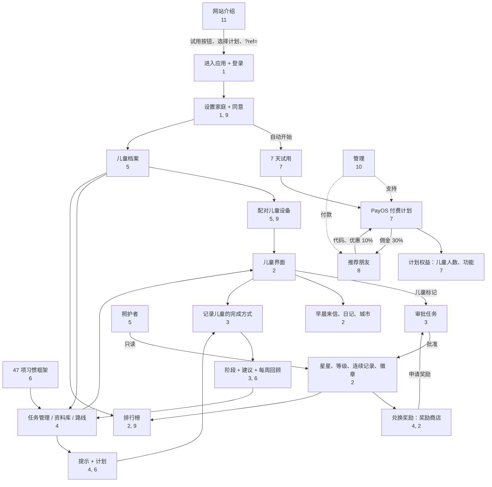

# 12. 链接地图和使用场景

[← 11. 网站和公开页面](11-website-va-trang-cong-khai.md) · [目录](README.md) · [下一章：13. 术语表 →](13-thuat-ngu.md)

<!--op-->## 本文内容

[链接地图](#ban-do) · [依赖关系矩阵](#phu-thuoc) · [端到端流程](#hanh-trinh) · [典型的一天](#mot-ngay) · [故障排查](#su-co) · [相关内容](#lien-quan)<!--/op-->

本文展示**各项功能如何关联**：哪些功能依赖其他功能、数据如何流动，以及用户在真实情境中会使用哪些功能。

## 链接地图

图表要点：

- **两个每日循环**：*任务 → 儿童标记完成 → 家长批准 → 星星 → 奖励 → 申请奖励 → 审批*；以及*标记完成 → 记录儿童的完成方式 → 阶段和建议 → 调整任务*。
- **计划是大多数家长区域的入口**：试用和计划决定儿童人数以及是否可使用管理功能。
- **推荐通过付款流程实现**：购买前使用代码获得折扣，付款成功后会产生佣金。
<!--op-->- **管理**位于家庭流程之外，仅支持付款、退款和佣金支付。<!--/op-->

## 依赖关系矩阵

逐行从左向右阅读：第一列中的功能**需要或使用**中间列的项目，并会**产生或影响**最后一列的项目。

| 功能 | 需要 / 使用 | 产生 / 影响 | 参见 |
|---|---|---|---|
| 儿童档案 | 有效计划；确认同意 | 年龄阶段、适龄界面、配对码、适龄任务计划 | [5](05-gia-dinh-va-cai-dat.md#ho-so) |
| 设备配对 | 儿童档案；（如已设置则需要 PIN） | 无需账户的儿童界面；可撤销设备访问权限 | [5](05-gia-dinh-va-cai-dat.md#ghep-thiet-bi) |
| 任务（活动） | 儿童档案或“家庭”；可来自框架、路线或资料库 | 儿童任务列表、积分；可能需要审批 | [4](04-thiet-ke-thoi-quen.md) |
| 儿童标记任务完成 | 任务；服务器接受前天至明天的日期 | 星星（或待审批状态）、连续记录、徽章、活动日记 | [2](02-man-hinh-be.md#hoan-thanh) |
| 批准任务 / 奖励 | 如已设置则需要 PIN | 增加或不增加星星；奖励：批准后发放，或退还星星 | [3](03-hom-nay-va-duyet-viec.md#duyet) |
| 星星 | 已确认的任务 | 兑换奖励、建造城市；累计获得数不会减少 | [2](02-man-hinh-be.md#sao-cap-chuoi) |
| 16 枚人物徽章 | 来自框架的任务（框架代码） | 徽章；第 16 枚人物徽章需要先获得其他人物徽章 | [2](02-man-hinh-be.md#huy-hieu)、[6](06-khoa-hoc-thoi-quen.md#chan-dung) |
| 提示 / 计划 | 使用中的任务 | 习惯阶段；建议 | [4](04-thiet-ke-thoi-quen.md#chuong-trinh) |
| 记录儿童的完成方式 | 已完成任务 | 更准确的建议；不用于排名 | [3](03-hom-nay-va-duyet-viec.md#muc-ho-tro) |
| 每日连续记录 | 已确认的任务；家庭休息日 | 火焰；联赛段位 | [2](02-man-hinh-be.md#sao-cap-chuoi) |
| 家庭休息 | 家长操作 | 隐藏进度提醒、连续记录和排行榜；暂停任务提醒；不打断连续记录 | [5](05-gia-dinh-va-cai-dat.md#tam-nghi) |
| 公开排行榜 | 开启分享 + 选择儿童 | 昵称、周期得分、名次 | [9](09-bao-mat-va-rieng-tu.md#bxh-cong-khai) |
| 任务提醒 | 家长同意；存在待审批项目；家庭未暂停 | 横幅、浏览器通知 | [3](03-hom-nay-va-duyet-viec.md#nhac-viec-ngan) |
| 付款 | 家长、已登录账户、如已设置则需要 PIN | 计划和期限；收据邮件；佣金 | [7](07-goi-va-thanh-toan.md#thanh-toan) |
| 优惠码 | 家庭账户 | 额外使用天数 | [7](07-goi-va-thanh-toan.md#coupon) |
| 推荐码 | 尚未付款的新家庭 | 首个年付计划优惠 10%；推荐人获得佣金 | [8](08-gioi-thieu-ban-be.md) |
| 提取佣金 | 加入计划；PIN；至少 200,000 VND；冻结期结束 | 提现申请 → 管理员银行转账 | [8](08-gioi-thieu-ban-be.md#rut-tien) |
| 退款 | 客户提出的客服工单 | 追回该订单佣金；状态邮件 | [7](07-goi-va-thanh-toan.md#hoan-tien) |
| 照护者 | 家长邀请；Google 登录 | 只读进度视图 | [5](05-gia-dinh-va-cai-dat.md#nguoi-cham-soc) |
| 删除数据 | 家庭所有者；PIN；输入 `DELETE FAMILY` | 删除儿童、任务、进度、奖励和设备；无法撤销 | [9](09-bao-mat-va-rieng-tu.md#xoa-du-lieu) |

## 端到端流程

### A. 新家庭：从了解应用到建立稳定习惯

1. 在网站阅读[博客](11-website-va-trang-cong-khai.md#blog)、[框架](11-website-va-trang-cong-khai.md#trang-khung)和[价格页面](11-website-va-trang-cong-khai.md#trang-chinh)。您也可以试用[演示](01-bat-dau.md#demo)。
2. 点击**7 天免费试用** → 使用 Google 登录 → [设置家庭](01-bat-dau.md#thiet-lap)（试用会自动开始）。
3. 创建[儿童档案](05-gia-dinh-va-cai-dat.md#ho-so)，加载六项适龄任务，或从[框架](04-thiet-ke-thoi-quen.md#khung-47)中选择。创建一些[奖励](04-thiet-ke-thoi-quen.md#kho-qua)。
4. 为儿童[配对设备](05-gia-dinh-va-cai-dat.md#ghep-thiet-bi)；设置 [PIN](05-gia-dinh-va-cai-dat.md#pin)。
5. 选择一两项任务并[设置提示](04-thiet-ke-thoi-quen.md#chuong-trinh)。每天由儿童标记任务完成，您[批准任务](03-hom-nay-va-duyet-viec.md#duyet)，并给予具体肯定。
6. 每周花 5 分钟[回顾](03-hom-nay-va-duyet-viec.md#nhin-lai-tuan)；根据建议添加任务、保持节奏或调整任务。
7. 第 7 天前选择一个[计划](07-goi-va-thanh-toan.md#cac-goi)以继续使用（付款前可输入[推荐码](08-gioi-thieu-ban-be.md#giam-10)）。

### B. 添加第二名儿童

前往[儿童](05-gia-dinh-va-cai-dat.md#ho-so) → 添加。您需要家庭计划或有效试用（基础版计划最多允许 1 名儿童）。每名儿童都有单独的代码和设备；可分别[撤销](05-gia-dinh-va-cai-dat.md#thiet-bi)每台设备。

### C. 全家外出或有人生病

选择[休息一下](05-gia-dinh-va-cai-dat.md#tam-nghi)：连续记录会保留，休息日不算漏做，任务提醒会暂停。返回后选择“恢复”。

### D. 推荐朋友

加入[计划](08-gioi-thieu-ban-be.md#tham-gia) → 发送链接 → 朋友输入代码，购买年付计划时享受[九折](07-goi-va-thanh-toan.md#giam-gia) → 朋友付款 → 您获得一笔[冻结 35 天的佣金](08-gioi-thieu-ban-be.md#hoa-hong) → 设置 PIN 并保存收款资料 → [申请提现](08-gioi-thieu-ban-be.md#rut-tien) → 管理员[转账](10-quan-tri-va-van-hanh.md#gioi-thieu-admin)。

<!--op-->### E. 客户申请退款

客户在 30 天内提供订单代码 → 客服[创建工单](10-quan-tri-va-van-hanh.md#phieu-ho-tro) → 财务批准 → 人工处理退款 → 确认完成 → 追回该订单的[佣金](08-gioi-thieu-ban-be.md#hoan-tien-hoa-hong) → 向客户发送[电子邮件](07-goi-va-thanh-toan.md#email)。<!--/op-->

## 典型的一天

| 时间 | 儿童 | 家长 | 备注 |
|---|---|---|---|
| 07:00 起 | 阅读[吉祥物来信](02-man-hinh-be.md#thu-buoi-sang) | | 每天一封新信 |
| 早晨 | 完成早晨任务、[计时](02-man-hinh-be.md#dem-gio)刷牙，并标记任务完成 | 若任务需要审批，则收到[提醒](03-hom-nay-va-duyet-viec.md#nhac-viec-ngan) | 需要审批的任务等待家长处理 |
| 晚上 | 完成剩余任务、写[一句话日记](02-man-hinh-be.md#nhat-ky)、查看[徽章](02-man-hinh-be.md#huy-hieu) | [审批](03-hom-nay-va-duyet-viec.md#duyet)、[记录儿童的完成方式](03-hom-nay-va-duyet-viec.md#muc-ho-tro)，并给予具体肯定 | 审批后增加星星 |
| 周末 | 可能会申请[奖励](02-man-hinh-be.md#qua) | [回顾本周](03-hom-nay-va-duyet-viec.md#nhin-lai-tuan)、[打印每周内容](03-hom-nay-va-duyet-viec.md#thong-ke)，并发放奖励 | 可获得调整任务的建议 |

## 故障排查

| 现象 | 常见原因 | 处理方法 |
|---|---|---|
| 儿童标记任务完成后看到**“无法保存，请重试。”**及括号中的代码 | 查看下方代码 | 卡片会恢复之前状态；请重试 |
| 代码 `no-child` | 此设备未能选择儿童档案（从家长账户打开儿童模式后可修复） | 重新加载页面；若仍然出现，请向客服提供代码 |
| 代码 `no-session` | 设备未登录或尚未配对 | 以家长身份重新登录，或在儿童设备上使用[代码](05-gia-dinh-va-cai-dat.md#ghep-thiet-bi)重新配对 |
| 代码 `no-activity` | 任务刚被删除或尚未加载 | 重新加载页面 |
| 代码 `request-401` | 会话已过期 | 重新登录 |
| 代码 `request-403` | 无操作权限或 PIN 尚未解锁 | 输入 [PIN](05-gia-dinh-va-cai-dat.md#pin)或使用正确账户 |
| 代码 `request-409` | 服务器拒绝更改（例如日期超出允许范围，或档案与任务不再匹配） | 重新加载，并选择接近今天的日期 |
| 代码 `points-spent` | 此任务获得的星星已用于兑换奖励，因此无法撤销更改 | 保持现状，或让家长[调整星星](03-hom-nay-va-duyet-viec.md#chinh-sao) |
| 代码 `error-…` | 网络或其他错误 | 检查连接并重试 |
| 标记任务完成后**没有星星** | 任务需要家长审批 | [批准任务](03-hom-nay-va-duyet-viec.md#duyet) |
| 无法扫描 QR 码 | 尚未授予相机权限，或连接不是 https | 授予权限或手动输入代码 |
| 配对码被拒绝 | 代码已刷新，或错误尝试次数过多 | 在[儿童](05-gia-dinh-va-cai-dat.md#ghep-thiet-bi)中获取新代码；若触发速率限制，请等待几分钟 |
| 已转账但尚未显示计划 | 正在等待 PayOS 确认 | 等待几分钟后重新打开 `/checkout`；不要再次付款；向客服提供订单代码（[启用](07-goi-va-thanh-toan.md#kich-hoat)） |
| 无法添加儿童档案 | 计划已到期，或基础版计划已有 1 名儿童 | 购买计划或[升级](07-goi-va-thanh-toan.md#cac-goi) |
| 看不到推荐码输入框 | 家庭已付款、记录时限已过，或已有代码 | 无法再记录其他代码（[8](08-gioi-thieu-ban-be.md#giam-10)） |
| 无法提取佣金 | 尚未设置 PIN、金额不足 200,000 VND、冻结期未结束，或刚更改收款资料（需等待 24 小时） | 查看[申请提现](08-gioi-thieu-ban-be.md#rut-tien) |
| 儿童看不到公开排行榜 | 分享已关闭、未选择该儿童，或家庭已暂停 | [开启分享](05-gia-dinh-va-cai-dat.md#rieng-tu)并选择儿童 |
| 连续记录丢失 | 超过一天没有获确认的任务 | 重新检查计数；下次可选择[休息一下](05-gia-dinh-va-cai-dat.md#tam-nghi) |
| 没收到登录或生命周期邮件 | 邮件进入垃圾邮件；地址曾退信；电子邮件验证码登录未启用 | 检查垃圾邮件；使用 Google 登录 |
| 儿童设备遗失 | 需要阻止访问 | [撤销设备](05-gia-dinh-va-cai-dat.md#thiet-bi)并刷新代码 |

联系客服（[联系](11-website-va-trang-cong-khai.md#trang-chinh)）时，请提供支持代码、时间和刚才执行的操作。**请勿发送**密码、PIN 或尚未过期的配对码。

## 相关内容

[目录](README.md) · [术语表](13-thuat-ngu.md) · [隐私与安全](09-bao-mat-va-rieng-tu.md)<!--op--> · [管理与运营](10-quan-tri-va-van-hanh.md)<!--/op-->
